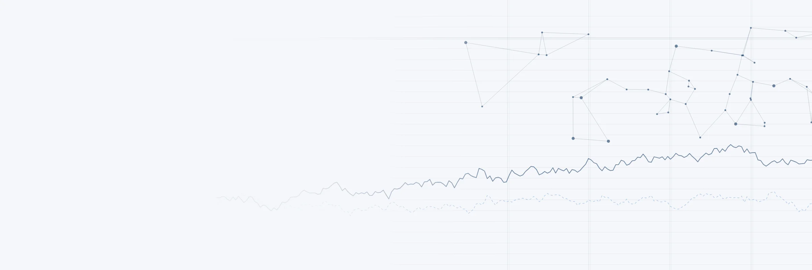

::: {.hero-band .hero-band--art}
```{=html}

```

[John Barrios · Yale School of Management]{.hero-kicker}

# Claude Code for Accounting Research

A hands-on PhD course on agentic AI for empirical accounting research, with five build modules and a closing seminar. It starts at first install and ends at a verified WRDS-to-Stata pipeline. The seminar then discusses what these tools mean for the profession.

::: {.hero-facts}
6 modules · 5 labs · 41 skills · 1 verification protocol
:::

::: {.hero-buttons}
[Start with Setup](setup.qmd)
[View the syllabus →](syllabus.qmd){.hero-link}
:::
:::

::: {.start-path}
[Start here]{.start-path__label}

1. [General Setup](setup.qmd)
2. [WRDS MCP Setup](setup-wrds.qmd)
3. [Module 1: Foundations](modules/01-foundations.qmd)
4. [Module 1 Lab](labs/day1.qmd)
:::

Each of the five build modules runs about three hours: a short lecture, a live demo, an extended lab and a debrief. Each one ends with something you keep, such as a reproducible pipeline, a publication-style figure, a text-extraction skill, or a regression-ready Compustat extract on your own WRDS account. Every module covers speed, but it also covers what you need before that speed is usable in a paper: verification, paper trails, credential hygiene, and judgment about whether a measure is valid, which no agent supplies. Module 6 is a discussion seminar on AI, the production of knowledge, and the academic research market. It ends with a position memo instead of a lab.

The course assumes no Claude Code experience. It does assume a laptop you control, a working WRDS account, and that you are willing to run code live.

## The six modules

::::::: {.module-grid}

:::: {.module-card}
[{.module-card__icon width="28" height="28"}[Module 1]{.module-card__kicker-text}]{.module-card__kicker}

[[Foundations](modules/01-foundations.qmd)]{.module-card__title}

[What kind of tool is this, and how do I stay in control?]{.module-card__question}

::: {.module-card__links}
[Open module →](modules/01-foundations.qmd){.module-card__open} [Lab](labs/day1.qmd) [Slides (PDF)](assets/slides/day1_slides.pdf)
:::
::::

:::: {.module-card}
[{.module-card__icon width="28" height="28"}[Module 2]{.module-card__kicker-text}]{.module-card__kicker}

[[The Empirical Loop](modules/02-empirical-loop.qmd)]{.module-card__title}

[Can I go from idea to verified figure, reproducibly?]{.module-card__question}

::: {.module-card__links}
[Open module →](modules/02-empirical-loop.qmd){.module-card__open} [Lab](labs/day2.qmd) [Slides (PDF)](assets/slides/day2_slides.pdf)
:::
::::

:::: {.module-card}
[{.module-card__icon width="28" height="28"}[Module 3]{.module-card__kicker-text}]{.module-card__kicker}

[[EDGAR Text → Data, + Skills](modules/03-edgar-text.qmd)]{.module-card__title}

[Can I build a text measure I'd defend to a referee?]{.module-card__question}

::: {.module-card__links}
[Open module →](modules/03-edgar-text.qmd){.module-card__open} [Lab](labs/day3.qmd) [Slides (PDF)](assets/slides/day3_slides.pdf)
:::
::::

:::: {.module-card}
[{.module-card__icon width="28" height="28"}[Module 4]{.module-card__kicker-text}]{.module-card__kicker}

[[WRDS MCP at Scale](modules/04-wrds-mcp-scale.qmd)]{.module-card__title}

[Can Claude work my licensed data, safely, on my account?]{.module-card__question}

::: {.module-card__links}
[Open module →](modules/04-wrds-mcp-scale.qmd){.module-card__open} [Lab](labs/day4.qmd) [Slides (PDF)](assets/slides/day4_slides.pdf)
:::
::::

:::: {.module-card}
[{.module-card__icon width="28" height="28"}[Module 5]{.module-card__kicker-text}]{.module-card__kicker}

[[Writing, Safety, Verification](modules/05-writing-verify.qmd)]{.module-card__title}

[What do I delegate, and how do I make my work auditable?]{.module-card__question}

::: {.module-card__links}
[Open module →](modules/05-writing-verify.qmd){.module-card__open} [Lab](labs/day5.qmd) [Slides (PDF)](assets/slides/day5_slides.pdf)
:::
::::

:::: {.module-card .module-card--seminar}
[{.module-card__icon width="28" height="28"}[Module 6 · Seminar]{.module-card__kicker-text}]{.module-card__kicker}

[[Seminar: AI & the Research Market](modules/06-ai-knowledge-market.qmd)]{.module-card__title}

[What will I still be paid for?]{.module-card__question}

::: {.module-card__links}
[Open module →](modules/06-ai-knowledge-market.qmd){.module-card__open} [Slides (PDF)](assets/slides/day6_slides.pdf)
:::
::::

:::::::

## Beyond the modules

The [Skills catalog](skills/index.qmd) has 41 agent skills for accounting research, covering econometrics, data work, writing and review. Each has a download and a one-line install command. The [Tools guide](tools.qmd) compares Claude Code with Claude Desktop, Cursor, and Codex, and includes a decision table for choosing one for each task. The [Prompt gallery](prompts.qmd) collects every reusable prompt the course teaches. The [Verification protocol](verification.qmd) is the one-page checklist you practice in every module. [Resources](resources.qmd) lists other useful tools and readings, grouped by the module where each is most relevant.

Taught by [John Barrios](about.qmd), Yale School of Management. Course materials draw on outside sources, which are credited on the [About](about.qmd) page. All student-facing content is original.
