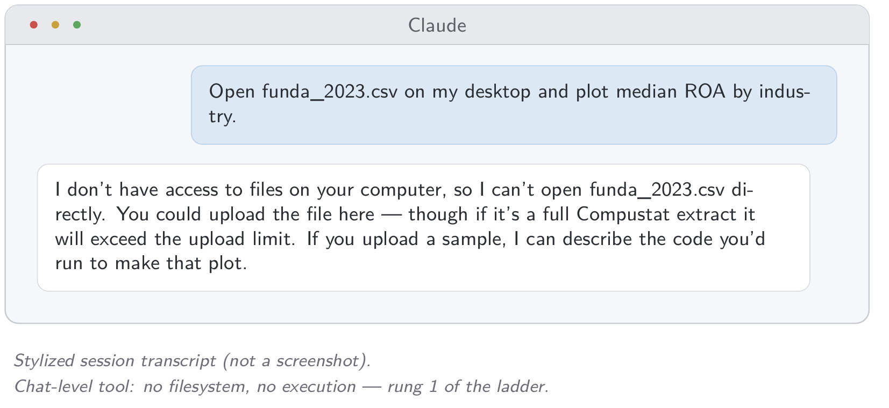
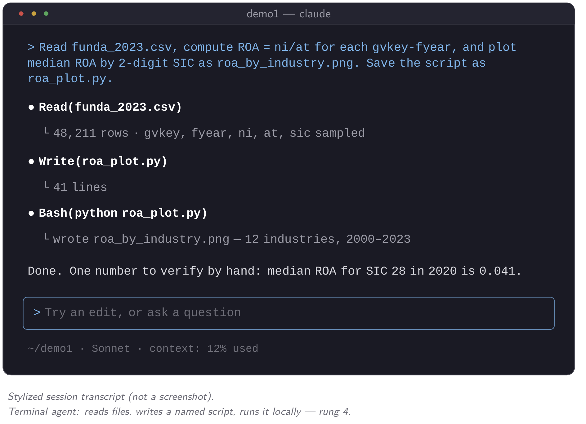
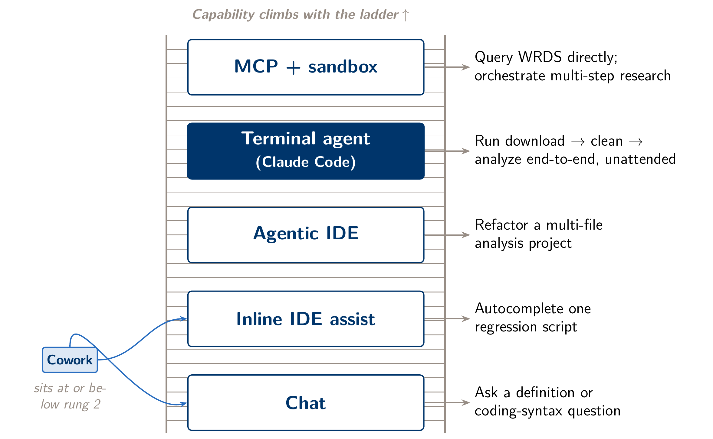
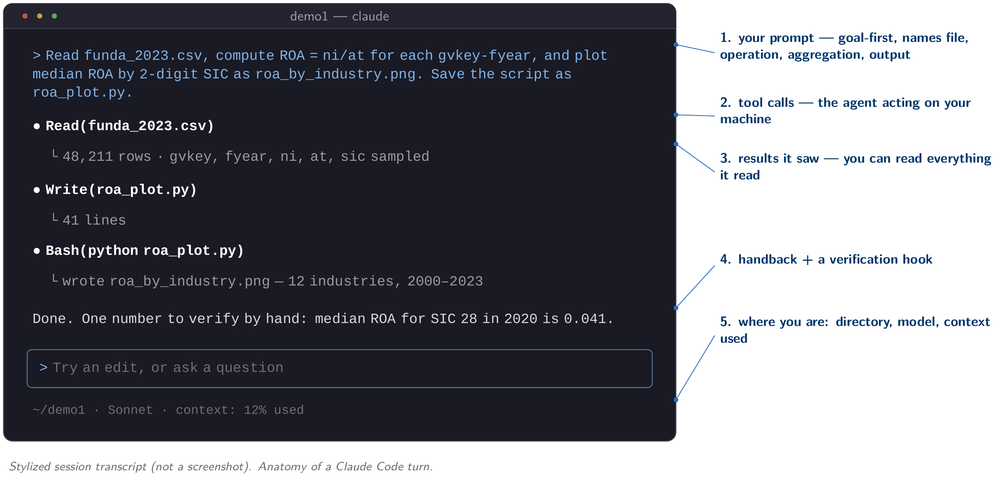
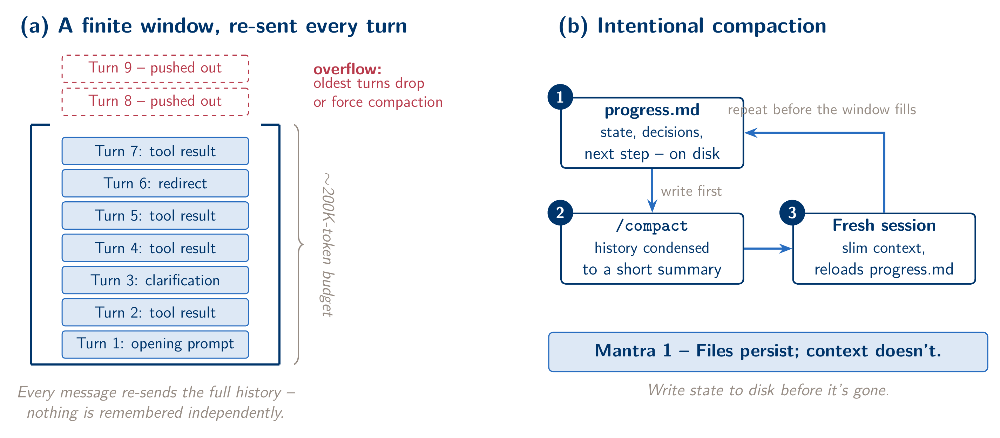
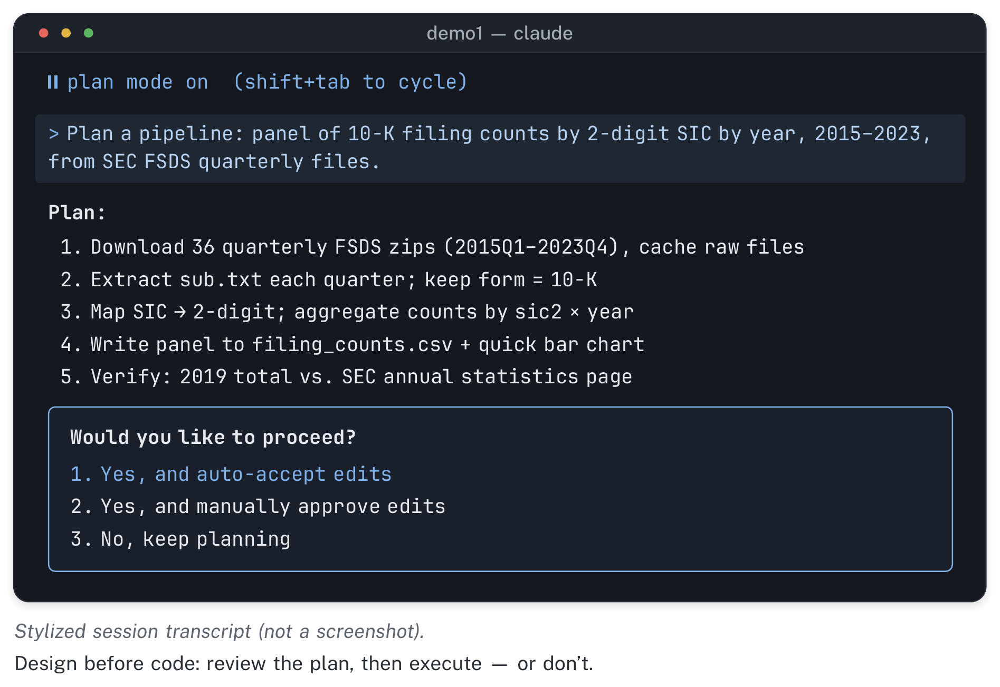
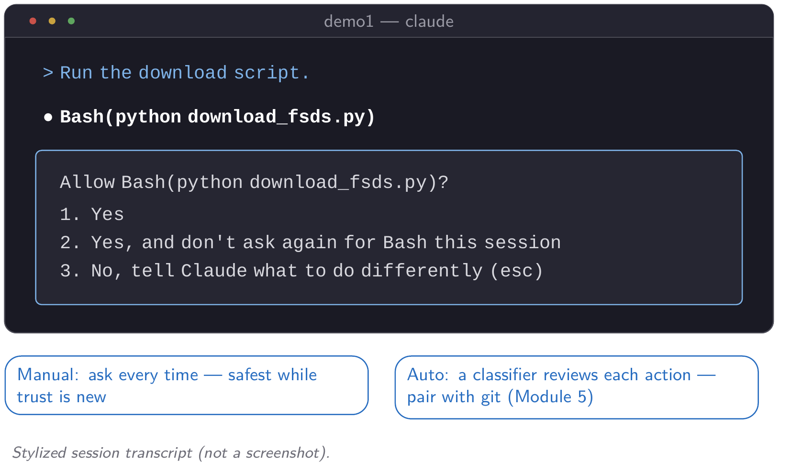
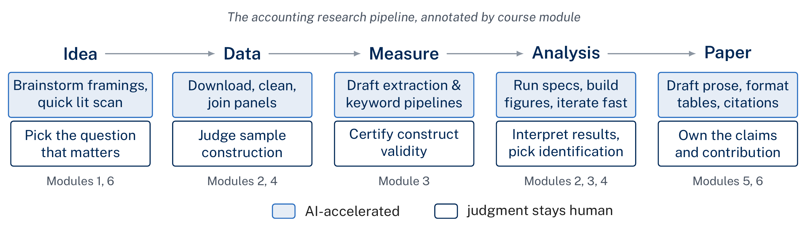

::: {.module-links}
[[]{.bi .bi-play-btn aria-hidden="true"} Video (12 min)](#module-video){.is-primary}
[[]{.bi .bi-file-earmark-pdf aria-hidden="true"} Module 1 slides (PDF)](../assets/slides/day1_slides.pdf)
[[]{.bi .bi-tools aria-hidden="true"} Lab](../labs/day1.qmd)
[[]{.bi .bi-file-earmark-zip aria-hidden="true"} Starter pack (zip)](../assets/labs/lab1_starter.zip)
:::

```{=html}
<div class="module-video" id="module-video">
  <p class="module-video__label" id="module-video-label">
    <span class="bi bi-play-circle" aria-hidden="true"></span>
    Watch: Module 1 walkthrough (12 min, narrated slides)
  </p>
  <div class="module-video__frame">
    <video controls preload="metadata" playsinline
           poster="../assets/video/module1_poster.jpg"
           aria-labelledby="module-video-label">
      <source src="../assets/video/module1_foundations.mp4" type="video/mp4">
      <track kind="captions" src="../assets/video/module1_foundations.en.vtt"
             srclang="en" label="English" default>
      <p>Your browser cannot play this video.
        <a href="../assets/video/module1_foundations.mp4">Download the MP4</a> instead.</p>
    </video>
  </div>
  <p class="module-video__meta">
    <a href="../assets/video/module1_foundations.mp4" download>
      <span class="bi bi-download" aria-hidden="true"></span> Download video (MP4, 25 MB)</a>
    <span aria-hidden="true">·</span>
    <a href="../assets/video/module1_foundations.en.vtt" download>Captions (WebVTT)</a>
  </p>
</div>
```

Most people first meet AI through a chat window or a Cowork-style helper in a browser tab, and the first real research task they give it usually breaks it. Ask it to open a Compustat extract, join it to a filing index, and produce a labeled figure, and it stalls. It cannot see your filesystem, it cannot run your code, and it forgets the conversation when you close the tab. The natural conclusion is "AI can't do real research work." That is true of the tool you tried. It is not true of agentic AI in general, because you were on a low rung of a ladder that goes much higher.

::: {layout-ncol=2}
{fig-alt="Mock chat window where an assistant, asked to open a Compustat file, replies that it cannot access local files."}

{fig-alt="Mock terminal session where Claude Code reads the same Compustat file, writes a script, runs it, and reports the result."}
:::

Claude Code is a different kind of tool. It is an agent that runs in your terminal: it reads and writes files, runs your R, Python, or Stata code on your own machine, and carries out a multi-step plan instead of answering one question at a time. It also has no memory of its own, and this module is organized around that fact. Every session starts blank. Everything it "knows" about your project at any moment is whatever has been typed into the current conversation or written to a file it can read. In this module you install it, place it on the tool ladder, and build the habits that make an agent with no memory trustworthy for research: writing state to files, checking output the way you would an RA's, and being specific about what you want. Module 6 returns to a harder question: what does an agent this capable change about how accounting research gets produced, and which parts of the job stay yours?

::: {.callout-note icon=false}
## Learning objectives

By the end of this module, you should be able to place Claude Code correctly on a five-rung tool ladder and explain why the rung matters for a data-intensive accounting task; describe, in your own words, why Claude Code carries no memory between sessions and what that implies for how you work; rewrite a vague research prompt into one that names the input file, the operation, the level of aggregation, and the output; write a minimal CLAUDE.md for a real project and confirm that it loads; and see where this module's habits fit in the rest of the course: where an agent saves you time, and where the judgment stays with you.
:::

## The tool ladder: five rungs, one decision

AI tools differ in capability, and the level determines which research tasks are feasible at all. Think of five rungs. At the bottom, a plain chat interface answers questions about text you paste in. It is useful for a quick methods question and useless for working with real data. One rung up, an inline assistant inside an editor (think Cursor's autocomplete or an IDE chat panel) can suggest and insert code as you type. That helps with a quick Stata do-file edit, but you still make every keystroke. Above that, an agentic IDE assistant can make a short chain of edits across a few files without you approving each line. It closes some of the gap, but it is still limited to the editor's sandbox and its narrower view of your project.

Claude Code is on the fourth rung. It is a terminal agent with direct filesystem access that can run any local command. It can write a Python script, run it, read the error, fix the script, and rerun it without you retyping anything. This course works at that rung. On the fifth rung, the agent is also connected to external services and sandboxed execution environments through the Model Context Protocol. You will use this in Module 4, where a WRDS MCP server lets Claude query Compustat with your own credentials without ever seeing your password. Where a Cowork-style browser assistant sits depends on how it is configured. By default it sees only a limited, browser-scoped view of your work, which puts it closer to rung two than rung four. That is not a criticism of the tool. It was built for a different job.

{fig-alt="Diagram of a five-rung ladder. From bottom: plain chat, inline code assistant, agentic IDE assistant, terminal agent, and agent wired to external services, with the research task each rung makes feasible."}

The [Tools](../tools.qmd) page compares the products in full. In this module, the decision rule matters more than the product names: if the task requires touching real files, running real code, and iterating on its own, you need rung four or above.

::: {.callout-warning icon=false}
## Common failure: dismissing AI after a Cowork-level disappointment

If your first experience with agentic AI was a browser-based assistant that couldn't open your data file, you may conclude that AI assistants can't help with research at all. That conclusion is wrong. The tool did what it was built to do, and it was not built to touch your filesystem. Many students come to this course after that experience, and it is a reasonable one to have had. The fix is to work out which rung the task needs, not to give up on every rung.
:::

## Claude Code as a terminal-resident RA

For this course, think of Claude Code as a research assistant who sits at your terminal, not a search engine you type questions into. It reads the files in your project directory, writes new scripts, executes them using whatever R, Python, or Stata installation already exists on your machine, and reports back what happened — including the error message, if there was one. Because the code runs on your own machine, your local environment has to work. If Python isn't installed, or your Stata license path isn't configured, a more capable agent does not fix that. The agent is a capable collaborator, not a virtual computer.

{fig-alt="Annotated mock Claude Code terminal turn, with labels pointing to the user prompt, the tool calls, what the agent saw, its summary, and the next input line."}

This changes what it means to use Claude Code well. With a chat tool, you might try to write one perfect prompt and hope for one perfect answer. With Claude Code you are managing a collaborator. It will draft a merge script for a Compustat and CRSP extract, run it, look at the row counts, and tell you what it found, as a first-year RA would. As with an RA, you need to check the work before you rely on it.

::: {.callout-warning icon=false}
## Common failure: assuming the runtime is handled for you

Because Claude Code feels conversational, it is tempting to assume it brings its own Python or R environment, as a cloud notebook does. It does not. It uses whatever is installed locally, and local setup is a common Module 1 blocker. Windows is the usual problem case, because a native Python install and a WSL-based one can differ without any warning. If `claude` launches but a script it writes fails with "command not found," check your local runtime before assuming something is wrong with the agent.
:::

## Context window mechanics: everything, every turn

Claude Code does not remember your project between turns the way a person would. Every time you send a message, the whole conversation so far is sent to the model again as one package. That package includes every prompt, every reply, and every file it has read into the conversation. The model has no separate memory of your project. It knows only what is in that package. Claude Code's standard context window is 200,000 tokens (some newer models offer up to a million). That sounds large, but reading one large CSV directly into the conversation can use a sizable share of it in a single turn. So don't ask the agent to read a giant Compustat extract into the conversation to "look at it." Ask it to write a script that processes the file on disk and reports back a summary. Type `/context` at any point in a session to see how full the window is and what is filling it.

::: {.callout-warning icon=false}
## Common failure: importing your Dropbox mental model

A hard habit to unlearn is treating a Claude Code session like a shared drive or an email thread, which keeps last week's work because it is "in the account." A session does not work that way. Nothing is retained across separate sessions unless it was written to a file that a future session can read. This is the main change in how you think about the tool in this module. The conventions introduced below (CLAUDE.md, progress files, named scripts) all exist because sessions carry no memory.
:::

## Degradation and intentional compaction

As a session runs long, two related things happen. First, the conversation grows, with more turns, more file contents, and more back-and-forth, until it nears the window's capacity. Second, response quality can drop well before the window is full. A session with many turns of trial and error, dead ends, and course corrections keeps all of that in the package that is re-sent every turn, and the noise can make the model reason less carefully about your next request.

The fix is to compact on purpose instead of letting the window fill by accident. Before a session gets unwieldy, ask Claude to write a short progress file, `progress.md`, that summarizes what has been decided and done so far: which filters were applied, which files exist, and what is left. Then run `/compact`, which condenses the conversation history into a much shorter summary retained in place of the full transcript. If something specific must survive compaction, say so. For example, ask Claude to compact while keeping every detail of a particular variable construction decision. For a fully fresh start, close the session and open a new one. Because `progress.md` and your project's `CLAUDE.md` are files, not conversation, the next session can read them and pick up where the last one left off. What you decided in one session is saved on disk instead of being lost when the session ends.

{fig-alt="Two-panel diagram. Left: conversation turns stacking inside a fixed 200K-token context window until it overflows. Right: a three-step cycle — write progress.md, run /compact, start a fresh session that reads the file."}

::: {.callout-warning icon=false}
## Common failure: treating compaction as forgetting everything

Compaction does not erase the session. It replaces a long, noisy transcript with a short summary of what mattered, much as you would hand a project to a colleague with a two-paragraph memo. There are two ways to get this wrong: avoiding `/compact` for fear of losing progress, or trusting it without first writing the important decisions to a file, where they are guaranteed to persist. Write the file, then compact.
:::

## Trust, but verify — the RA standard

If Claude Code is an RA at your terminal, treat its output the way you already treat a real RA's work. Trust the process enough to delegate it, and check the result before you build on it. This is ordinary supervision, applied to a new kind of collaborator. Suppose Claude produces a leverage ratio panel from a Compustat extract. Don't take the whole panel on faith. Pick one firm you know well, say a large, well-covered industrial firm, and check by hand that its computed leverage matches the balance sheet in that year's 10-K. If that check holds, you have grounds for confidence in the rest of the panel. If it doesn't, you have caught a construction error before it spread into every downstream table.

::: {.callout-tip icon=false}
## Verify this: one number, one independent source

Before you accept any computed output in this module, such as a row count, a ratio, or a figure, pick one value you can check against a source Claude did not touch, and check it by hand. It takes a few minutes, and it is the one step in this module's lab the agent cannot do for you. Only you can decide whether the number looks right.
:::

## Goal-first prompting: four components

Vague prompts rarely produce an obvious error. They produce something that looks plausible but isn't quite what you meant, and the gap grows over a session. The most useful habit for a beginner is to name four things in every prompt: the **file** you're operating on, the **operation** to perform, the **level of aggregation** the result should live at, and the **output** you expect back, by name and format.

Compare two versions of the same request. Vague: "Look at this Compustat file and tell me something about leverage." Specific: "Read `funda_1990_2023.csv`. For each gvkey-fiscal year, compute book leverage as long-term debt divided by total assets, winsorize it at the 1st and 99th percentiles, and compute the mean by fiscal year and two-digit SIC code. Save the result as `leverage_by_industry_year.csv`, and save a line figure with one line per two-digit SIC as `leverage_trends.png`, formatted for a working-paper draft." The second version leaves almost nothing to guess. The file is named, the transformation is unambiguous, the aggregation level is explicit, and the two output files are named in advance. Naming the output file in the prompt turns a one-off answer into a reproducible script, and Module 2's lab depends on that habit.

::: {.callout-warning icon=false}
## Common failure: describing the goal instead of the task

"Analyze this data and tell me what's interesting" describes a goal, not a task. It sounds thoughtful, but it hands the agent every decision you should make yourself: which variables matter, at what level, and how to report them. Before you send a prompt, check it against the four components above. If any one of file, operation, aggregation, or output is missing, add it before you hit enter.
:::

## Redirect, don't argue

Sometimes the agent starts down a path that is clearly wrong. It parses every fiscal quarter when you asked about one, or pulls every Compustat variable when you named three. The instinct is to type a correction while it keeps going, or worse, to go back and forth about what you meant. Both waste turns, because each extra turn adds more of the wrong direction to the context that gets re-sent. Instead, press Esc as soon as you notice the agent going off course. Esc stops the current action and gives you a clean point to redirect from, so you are not stacking a correction on a conversation already committed to the wrong plan. State the correction plainly, using the four components from the previous section, and let it start again.

Correct within two turns of noticing the problem, not ten. Catching a wrong direction early costs little. An eight-turn argument that ends in the same correction costs much more.

::: {.callout-warning icon=false}
## Common failure: arguing in natural language instead of interrupting

Typing "no, I meant just 2023, not all years" after the agent has already started a four-year pull doesn't undo the four-year pull. It adds a new instruction on top of a plan that has already gone wrong, and both versions now sit in the context. Interrupt first, then restate. The interruption stops the current plan, and the restatement tells the agent what to do instead.
:::

## Plan Mode: a first look

For anything bigger than a single script, ask Claude to plan before it builds. Pressing Shift+Tab cycles through the permission modes covered below; stop when the status bar reads *plan mode on*. In Plan Mode, the agent reads the relevant files, checks its assumptions, and proposes a step-by-step approach before it writes or runs any code. You review the plan, adjust it if something's off, and only then let it proceed. For a task like building a panel of filing counts by industry and year across several years of filings, planning first can turn a half-dozen false starts, found one at a time, into one considered pass.

{fig-alt="Mock Plan Mode screen: the agent lists a numbered step-by-step plan and waits for approval before executing anything."}

This module covers Plan Mode only briefly. You will turn it on, read a proposed plan for a bigger task than this module's lab requires, and set it aside without running it. Module 3 runs the full workflow of planning, building, and clearing context, once you have built more of the related habits.

::: {.callout-warning icon=false}
## Common failure: canceling out of Plan Mode too early

Watching Claude think through a multi-step design before writing any code can feel like wasted time, especially the first time you see it. It usually isn't. A few seconds of planning up front often saves several rounds of correction later, especially for work that touches more than one file or more than one data source. Let the plan finish before deciding whether to act on it.
:::

## CLAUDE.md: instructions that persist

One file makes the context-window problem manageable across a whole project. A file named `CLAUDE.md`, at the root of your project folder, is read automatically at the start of every session opened in that folder. It is standing context you don't have to retype, and because it is a file on disk, it does not depend on any one conversation. A minimal, useful CLAUDE.md states a language preference, one style convention, and one verification rule. For example, it might say that all output figures should follow a particular journal's formatting convention, or that any script touching raw data must print a row count before and after filtering.

Write one now. A handful of lines is enough. Then restart your session and ask Claude what it knows about the project's conventions, to confirm that the file loaded. A CLAUDE.md is different from a **skill**, which you will meet in Module 3. A CLAUDE.md is project-wide standing context, while a skill is a packaged, reusable procedure for a specific recurring workflow. You will update your CLAUDE.md throughout the course as your conventions settle. This module's version does not need to be complete, but everything in it should be accurate.

::: {.callout-warning icon=false}
## Common failure: writing CLAUDE.md and expecting it to apply mid-session

CLAUDE.md loads at the start of a session, not continuously. If you edit it while a session is already running, that session won't see the change. You have to start a new one. This confuses people because the file looks like it "isn't working," when it simply has not been loaded yet.
:::

## Permission modes: manual vs. auto

Claude Code can ask before it takes an action that touches your filesystem, such as writing a file, running a script, or installing a package. In this module you will see that request for the first time and work with the two modes that matter most. Manual asks you before every action that edits a file, runs a command, or reaches the network. Auto hands that review to a second model, a classifier, which lets routine actions through and blocks ones that look risky, so the agent can move through a multi-step task without stopping to ask each time. Recent versions of Claude Code start new sessions in Auto. Shift+Tab cycles through Manual, an accept-edits mode, and Plan Mode, and the status bar always shows which one you are in. Manual is the safer choice when you are still building trust in a new project or facing an operation that could delete or overwrite work. Auto is the better choice for iterative, exploratory work, which is most of what this course does.

{fig-alt="Mock terminal permission prompt asking to run a command, with options to approve once or for the rest of the session."}

Git is what makes Auto safe to use, and it costs nothing to set up. If every meaningful change is a commit, the worst an overeager agent can do is something you can roll back in seconds. You will build the full git habit in Module 5. For now, know that Auto plus git lets you work quickly and still undo mistakes. A third mode skips permission checks entirely. It has legitimate uses, but it belongs inside a sandboxed environment, not on your own machine. Module 5 covers it.

::: {.callout-warning icon=false}
## Common failure: staying in Manual mode out of caution and never leaving it

Manual mode feels safer, but in a multi-step pipeline it means approving the same kind of action ten or twenty times in a row. That trains you to click through prompts without reading them, which defeats the purpose of Manual mode. Auto mode with git commits gives you the same protection with far fewer interruptions.
:::

## The accounting research workflow map

Now place this module's habits inside an actual research project: idea, data, measure, analysis, paper. An agent like Claude Code speeds up parts of that pipeline: downloading a bulk filing index, writing the boilerplate to parse it, drafting a first-pass figure, and catching a malformed date column before it corrupts a merge. It does not, and should not, replace the stages that require your judgment: choosing which question is worth asking, deciding whether a text-based measure actually captures the construct you claim it does, and interpreting what a result means for the literature. Some stages go faster with an agent, and the others stay with you.

{fig-alt="Flowchart of the research pipeline from idea to data, measure, analysis, and paper, with agent-accelerated stages shaded and judgment-driven stages marked as human."}

This map is a starting point for Module 6's seminar, not a settled argument. You will return to a harder version of the question after five modules of running the pipeline yourself, when you have a real basis for an opinion about which stages belong to the agent and which belong to you.

## The three Module 1 mantras

These three sentences sum up the module, and you will use them for the rest of the course. They belong on your verification protocol card, which is on the [Verification](../verification.qmd) page.

1. **Files persist; context doesn't.** Anything that must outlast this session has to be written to a file.
2. **Trust, but verify — same as an RA.** Delegate freely, but check at least one result yourself before you sign off.
3. **Be specific: file, operation, aggregation, output.** Name all four in every prompt.

Next, go to [this module's lab](../labs/day1.qmd) to install Claude Code, write your first CLAUDE.md, and run one small task end to end with a verification step. The [Tools](../tools.qmd) page has the full product-by-product comparison behind this module's tool ladder, and the [Verification](../verification.qmd) page collects the protocol you'll keep building on across the course.
