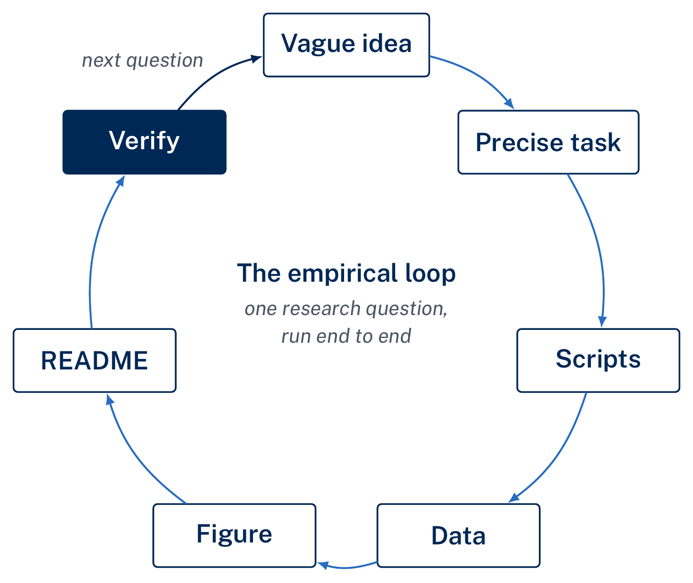
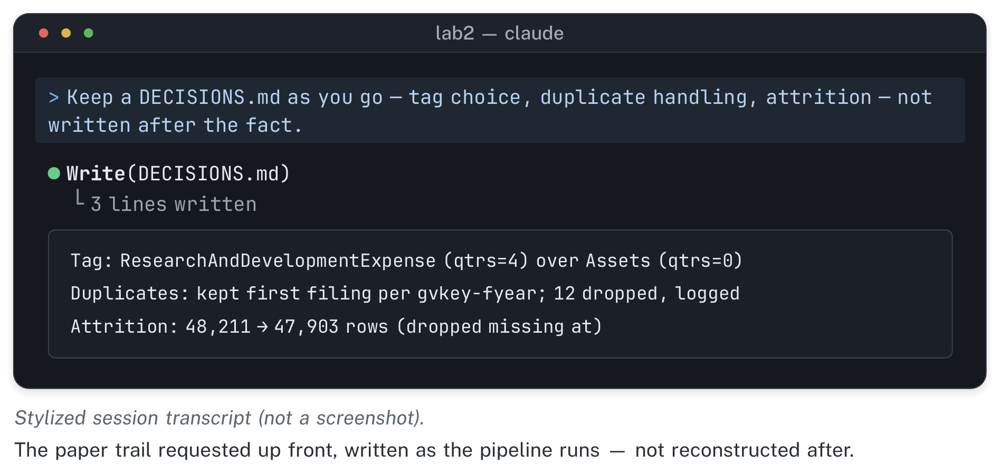
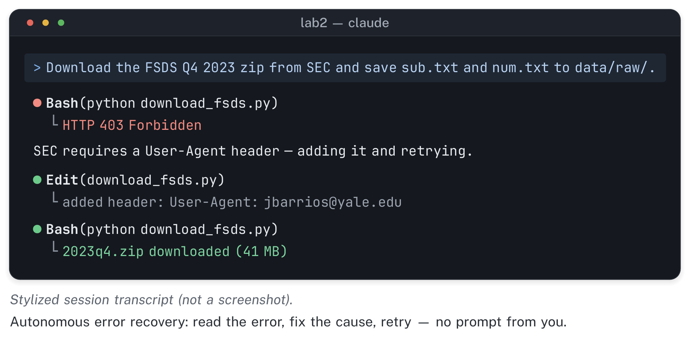
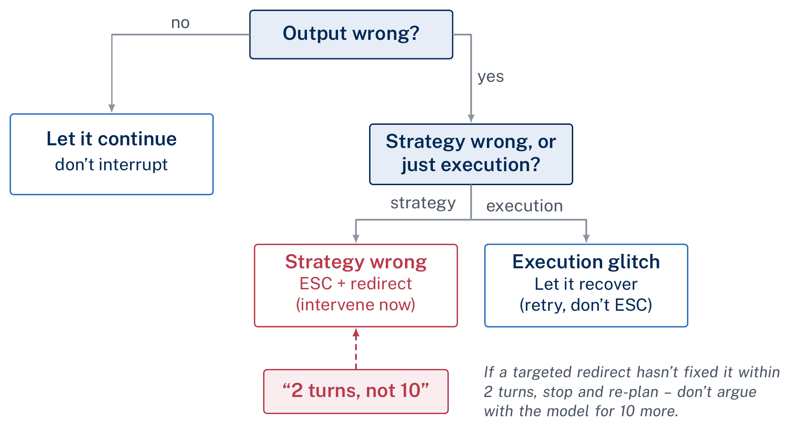

[Module 2 slides (PDF)](../assets/slides/day2_slides.pdf) · [Lab](../labs/day2.qmd)

Module 1 gave you the mental model: files persist and context doesn't, delegate and then verify, and say what you mean in four parts (file, operation, aggregation, output). So far you have not tested that model on a real research question. This module does. We take one accounting question, how R&D intensity has evolved across industries, from a vague idea to a verified, publication-style figure. You watch that happen in the demo, then do it yourself with a different measure. The lecture is short and mostly mechanical: what the dataset looks like, what the stages of the loop are, and which habits keep the work reproducible. Most of the learning happens in the demo and the lab, which run the same pipeline at two speeds.

The dataset for this module is the SEC's Financial Statement Data Sets (FSDS): free, quarterly bulk extracts of every XBRL-tagged financial value from every electronic filing the SEC receives. You need no credentials. There is no WRDS account, no Duo push, and no institutional subscription, only a zip file you can download to a laptop on a coffee-shop connection. FSDS is also structured the way Compustat is: a filing-metadata table, a tagged-values table, and a key that joins them. What you learn about FSDS here previews the shape of the Compustat pipeline you'll build in Module 4, once WRDS access is live.

::: {.callout-note icon=false}
## Learning objectives

By the end of this module, you should be able to describe the FSDS file structure (`sub.txt` and `num.txt`, pipe-delimited, joined on `adsh`) and explain how it maps onto the shape of Compustat; write and read a six-part opening prompt that specifies the data, the join, the measure, the aggregation, the output, and the paper trail before any code is written; run the full empirical loop yourself in a single lab session, from an empty folder to a verified figure and a README a stranger could rerun; expect a wrong first-draft figure as a normal first output of a pipeline, and fix it with one to three small, targeted refinement rounds instead of one long, over-specified prompt; write a `DATA_PROFILE.md` that states what one row is, tests that it is unique, and reports tag coverage before any figure exists; and apply at least two sanity checks (one benchmark comparison and one plausibility check), plus a plot of the raw series, before you sign off on any computed result.
:::

## The full loop, once, end to end

This module teaches the empirical loop by running it rather than describing it. The loop has five stages, and each one produces a file, not a conversation. You start from an empty folder. A download script pulls the raw FSDS extracts. A cleaning-and-join script turns the two raw files into an analysis-ready panel and prints its own attrition as it goes. A figure script turns the panel into a labeled, publication-style plot. A README, written last, states what a stranger would need to type to get from the empty folder back to the same figure. Every stage is required, and none of them happens in the chat window. When you finish, each stage is a named script on disk.

{fig-alt="Flow diagram of five stages — empty folder, download script, clean-and-join, figure script, README — each stage producing a named file on disk."}

Compare this with Module 1. Module 1 asked you to write one named script and check one number. This module asks for a chain of scripts, each feeding the next, with the sample size and the reasoning at every step written down as it happens rather than reconstructed afterward. The scale is bigger, but the habits are the same: state what you want in four parts, write it to a file, and verify before you trust it. Here you apply them across a whole pipeline instead of a single step.

## SEC FSDS anatomy: two files and one key

FSDS comes as one zip file per fiscal quarter, going back to 2009. Inside each zip are several pipe-delimited text files. Two of them matter for nearly everything you'll do in this course. `sub.txt` is the submissions file: one row per filing, giving you the accession number (`adsh`), the filer's central index key (`cik`), its SIC industry code, the form type (10-K, 10-Q, and so on), the fiscal year end, and the period the filing covers. `num.txt` is the numeric-values file: one row per tagged financial fact inside a filing, giving you the accession number again, the XBRL tag (a controlled vocabulary name like `Assets` or `ResearchAndDevelopmentExpense`), the date the value applies to, the number of quarters the value spans (`qtrs`: zero for a balance-sheet snapshot, four for a full fiscal year of a flow variable), and the value itself.

The join key that ties these two files together is `adsh`, the filing's accession number. It is the most important fact about FSDS for this course. `sub.txt` tells you *who filed what, when, in what industry*; `num.txt` tells you *what numbers that filing reported*; and `adsh` is the only reliable link between the two. Every pipeline you build in this module starts by reading both files and joining them on that column. Every pipeline should also report the row count in each file before the join and the row count after. A join that drops or duplicates rows without any warning is a common failure in panel construction, and an easy one to miss.

{fig-alt="Diagram of two tables, sub.txt filing metadata and num.txt tagged values, joined by arrows on the shared adsh accession-number key."}

This structure is also why you should learn FSDS before Compustat, not instead of it. Conceptually, Compustat's `funda` table does the same job as `num.txt`: one row per firm-year per reported variable. Its company file plays the role of `sub.txt`, giving you the industry code and the identifying metadata you join everything else against. If you learn the join-key discipline here, on free data with no account to wait for, Module 4's WRDS pipeline will look like a larger, better-documented version of something you already know.

## Profile the data before you plot it

Before the first figure, have Claude write a `DATA_PROFILE.md`: a short file that records what one row of each table is and what can go wrong with it. It takes a few minutes, it stays on disk where every later session can read it, and it catches errors that a clean-looking figure will hide. Ask for it in the opening prompt, alongside `DECISIONS.md` and `LOG.md`, so it is written before any measure is computed. For FSDS, the profile should answer the questions below.

**What is one row?** In `sub.txt`, one filing. In `num.txt`, one reported value: a tag, for a date, over a number of quarters, in a unit, within a filing. Write that sentence down in the profile.

**Is that row actually unique?** Don't rely on Claude's answer or on your own memory. Have Claude look up the key columns in the SEC's own FSDS documentation, then *test* it: count rows, count distinct combinations of those columns, and report both numbers. If they differ, you have duplicates, and you need to know why before you aggregate anything.

**How complete are the tags you plan to use?** For each tag in your measure (`Assets`, `ResearchAndDevelopmentExpense`, `LongTermDebt`), report the share of 10-K filings in each pinned quarter that report it at all. If a third of filers never report a tag, a measure built on that tag reflects who reports it as much as the underlying economics.

**What are the known problems?** A 10-K reports the prior year alongside the current one, so the same firm-year value appears in more than one filing. Decide which filing's value you keep, and write the rule down. Amended filings (`10-K/A`) restate values that an earlier filing already reported. Decide whether you keep the original or the amendment, and record that choice too.

The profile applies Module 1's first mantra, files persist and context doesn't, to the data layer. It also sets up Module 4, where you ask the same questions of Compustat and the answers become the metadata table and the iron-law filters.

## From vague idea to precise task, one more time

"How has R&D intensity evolved across industries?" is a good research question, but it does not work as a prompt. It doesn't say which years, which industry grouping, which measure of R&D, which measure of scale, or what the output should look like. An agent given that sentence has to guess at each of those choices, and you will spend your first several turns finding out, one at a time, which guesses were wrong. Module 1's four-component habit (file, operation, aggregation, output) closes that gap. In this module you use it on a real question instead of a toy one.

To turn the vague version into the precise version, answer these questions before you type anything: which files (which FSDS quarters, and which two files inside each), which join (on what key, checked how), which measure (R&D expense over total assets, but which XBRL tags, and filtered how), which aggregation (a statistic, by what grouping, over what time unit), and which output (what kind of figure, saved under what name, alongside what underlying table). A domain expert should make each of these decisions deliberately; the agent should not have to infer them. The opening-prompt template below applies this decomposition in full to the demo question, and it is the part of this module most worth keeping.

## Reproducibility as code, not chat lore

Put three small habits in place before you write the opening prompt. Adding them after the fact costs far more than building them in from the start.

The first is empty-folder discipline. Every new project starts in a fresh, empty directory (`mkdir ~/lab2 && cd ~/lab2 && claude`), so that when the agent looks around, it sees only this project. This matters more than you might expect. An agent that opens into a folder full of last month's Stata do-files, or another course's half-finished scripts, will sometimes let those files shape its sense of what the project is about. An empty folder rules that out.

The second is named-script discipline, which you met in Module 1 on a small scale and which this module relies on heavily. Every stage of the loop (download, clean, join, measure, figure) should exist as a named file (`download_fsds.py`, `clean_join.py`, `build_measure.py`, `make_figure.py`, or whatever names you choose), not as a number or a plot that exists only inside a chat reply. To check, ask yourself: if you deleted the entire conversation right now, would the pipeline still run? A named script passes that test. An answer typed into a chat window does not.

The third habit is new in this module: paper-trail prompting. Instead of asking for the analysis and adding documentation later, you request the documentation *in the same prompt that starts the work*. The prompt asks for a `DECISIONS.md` file that records each methodological choice as it is made (which tag was used when more than one was available, how a duplicate row was handled, why a filter was applied), a `LOG.md` file with a timestamped line at every major step, and an attrition row (sample size before, sample size after, and the reason for the change) printed every time the sample shrinks or grows. Ask for these upfront. A paper trail requested after the fact has to be reconstructed from memory, and Module 1 warned you not to rely on memory.

{fig-alt="Mock project listing with excerpts of DECISIONS.md, LOG.md, and an attrition row printed as a pipeline runs."}

## The opening-prompt template

Here is this module's demo prompt in full. Read it slowly. It is the most reusable artifact in the module, and you should keep it verbatim as a template for any empirical question you take through this pipeline. It has six parts. Four of them extend Module 1's four components. The other two, the join and the paper trail, are what you add once a single script becomes a multi-stage pipeline.

> **DATA:** Download the FSDS quarterly zip files for these fourteen quarters — Q4 of each year from 2010 through 2023 — from the SEC's Financial Statement Data Sets page. From each quarter we need two files: `sub.txt` (filing metadata: `adsh`, `cik`, `sic`, `form`, fiscal year end, period) and `num.txt` (tagged numeric values: `adsh`, `tag`, `ddate`, `qtrs`, `value`).
>
> **JOIN:** Merge `sub.txt` and `num.txt` on `adsh` — the filing's accession number, the only key that reliably links the two files. State the row count in each file before the join and the row count after, and flag any `adsh` values in `num.txt` with no match in `sub.txt`.
>
> **MEASURE:** R&D intensity, defined as R&D expense divided by total assets for each filer-period. Use the XBRL tag `ResearchAndDevelopmentExpense` for the numerator and `Assets` for the denominator. Keep `qtrs = 0` rows for `Assets` (a balance-sheet snapshot) and `qtrs = 4` rows for the R&D tag (a full fiscal year of a flow variable). Restrict to `form = 10-K`.
>
> **AGGREGATION:** Compute the median R&D-intensity ratio by two-digit SIC code (`sic2`, the first two digits of `sub.txt`'s `sic` column) and calendar year, across all fourteen quarters.
>
> **OUTPUT:** One line figure, one line per SIC2 industry, R&D intensity on the y-axis and year on the x-axis, formatted for a working-paper draft — white background, labeled axes, a legend, no default plotting-library styling — saved as `rd_intensity.png`. Save the underlying aggregated table as `rd_intensity_by_sic2_year.csv`.
>
> **PAPER TRAIL:** Write every stage as a named script — no output that exists only as a chat reply. Keep a `DECISIONS.md` recording every methodological choice as it's made — which tag was chosen when more than one was available, how duplicate rows were handled, any filter applied and why. Keep a `LOG.md` with a timestamped line for every major step. Print an attrition row — n before, n after, reason — every time the sample size changes.

Read the prompt again and notice what it rules out. There is no ambiguity about which quarters, which tags, which filter, which statistic, or which filename. The pipeline also cannot end up living only inside a transcript, because the prompt requires scripts and a paper trail as part of the deliverable. This is the six-part habit in full. Learn it well enough that you can write a version of it for any measure you construct in the rest of this course.

## Iteration is not failure

The first-draft figure is almost never the figure you want. Many people are surprised by this the first time, but it is normal and does not mean anything has gone wrong. A first pass at the R&D-intensity plot might have the wrong axis labels, too many industry lines crowded onto one plot to read, or an industry grouping too coarse or too fine to show the pattern you're looking for. Don't respond with one enormous, over-specified prompt that tries to anticipate every problem. Use small, targeted refinement rounds instead: fix the axes and labels, look at the result, then adjust the industry-bucket granularity and look again. Two or three rounds is typical, and each one should address one specific thing you can see is wrong in the previous draft. Count the rounds as you go. If you're past three and the figure is not converging, stop iterating and rethink the request itself.

The other kind of iteration in this module is autonomous error recovery. Watch it closely instead of jumping in to fix the problem yourself. SEC's servers reject bulk-file requests that don't identify the requester, so the first time a download script runs without a proper User-Agent header, it gets a bare "403 Forbidden." A capable agent reads that error, recognizes what it means, adds an identifying header, and retries successfully, without you typing any part of the fix.

{fig-alt="Mock terminal log: a download request returns 403 Forbidden, the agent adds a User-Agent header, retries, and succeeds."}

This applies the redirect-don't-argue principle from Module 1. You watch rather than drive, and you step in only when the *strategy* looks wrong, not every time an intermediate step throws an error. If the agent starts guessing wildly, keeps retrying the same broken approach, or heads toward a dead end, intervene. Press Esc, restate the goal plainly, and let it resume from a clean point, as Module 1's stuck-loop protocol described.

{fig-alt="Decision tree for a stalled pipeline: watch autonomous recovery first, and intervene by pressing Esc and restating the goal only when the strategy itself is wrong."}

You may also see a sub-agent appear in this module. For a long-running search or a task with several independent branches, Claude Code can start sub-agents: separate contexts that each investigate one piece of a problem and report back a summary, which saves the main conversation's context budget. This module's lab is small enough that you may not see one at all. Module 4 covers what sub-agents are and how to request parallel ones explicitly. If one does appear in your session, note it on your exit ticket; we'll come back to it.

## Sanity checks: two, minimum, before you sign off

Nothing above replaces judgment, and judgment matters most at the end, once a figure exists and looks plausible. Before you accept any computed result in this module, run at least two checks, and know what each one tests.

The first is a benchmark comparison. Pick one or two industries where you already have a strong prior about the answer. Pharmaceuticals and software should show clearly higher R&D intensity than utilities or retail, so confirm that the figure shows this. If it doesn't, something in the tag selection, the filter, or the aggregation is probably wrong, and it is much cheaper to catch that now than after the figure is in a slide deck. The second is a plausibility check tied to a known event: does the series behave as you'd expect around a real economic shock? R&D spending around 2020, for instance, should show some visible response to the disruption of that year. You don't need to know the direction in advance, but a real, economically meaningful series should show *some* response. A perfectly smooth line through a period you know was turbulent suggests that something upstream was over-aggregated or mis-constructed.

::: {.callout-tip icon=false}
## Verify this: name your two checks before you look at the figure

Decide what your benchmark comparison and your plausibility check will be *before* the figure renders. If you name the checks in advance, you are less likely to reason backward from whatever the figure shows to a story that makes it look right. Write both checks in your README, along with the source you're checking against. If a check isn't written down, nobody else can tell that you ran it.
:::

One more check takes little time and comes before both of these: plot the raw series before you aggregate it. Before computing a median by industry and year, plot the firm-level ratio itself, every observation by fiscal year, once before winsorizing and once after. A handful of firms reporting R&D larger than their total assets, a year where the number of observations collapses, a cluster of exact zeros that should be missing values: each of these is obvious in a raw scatter and invisible in a median. The raw plot does not replace the two checks you named in advance. It tells you whether the series is worth summarizing at all.

The benchmark and plausibility checks depend on domain knowledge, and an agent cannot run them for you. Claude Code can tell you the median R&D intensity came out at 4% for SIC code 28. It cannot tell you, on its own authority, whether 4% is a plausible number for pharmaceutical R&D intensity in 2019. That is accounting and finance judgment, and this course is built to protect it.

::: {.callout-warning icon=false}
## Common failure: treating a plausible-looking figure as a verified one

A figure with clean axis labels, a sensible legend, and smooth lines looks trustworthy. That polish says nothing about whether the tag selection, filter, or join was correct. A figure can look finished without being verified, and the two checks above are what verify it. Run them even when the plot looks clean.
:::

## The three Module 1 mantras, carried forward

Everything in this module rests on the same three sentences from Module 1, now applied to more work at once.

**Files persist; context doesn't.** In this module that means DECISIONS.md, LOG.md, attrition rows, and named scripts at every stage, not just at the end. **Trust, but verify — same as an RA.** In this module that means two named sanity checks before you sign off on a figure, not a vague sense that it looks fine. **Be specific: file, operation, aggregation, output.** In this module that habit grows to six parts (data, join, measure, aggregation, output, paper trail), because a full pipeline involves more decisions than a single script, and each one still needs to be stated rather than inferred.

From here, go to [this module's lab](../labs/day2.qmd), where you'll run the same loop yourself on a measure of your choosing. Your measure is different from the R&D demo, so your verification has to be your own rather than copied. The lab ends with a hard gate: every student needs a confirmed, working WRDS tunnel before Module 4's flagship lab depends on it. If you haven't tested `ssh wrds` and a Duo push since Module 1's homework, do it before you arrive for this module. Fixing an account or Duo problem through WRDS support takes at least two days. The lab's closing checkpoint is where we confirm access, so it is not left to the last minute.
