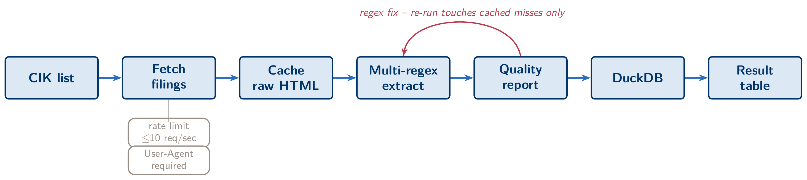
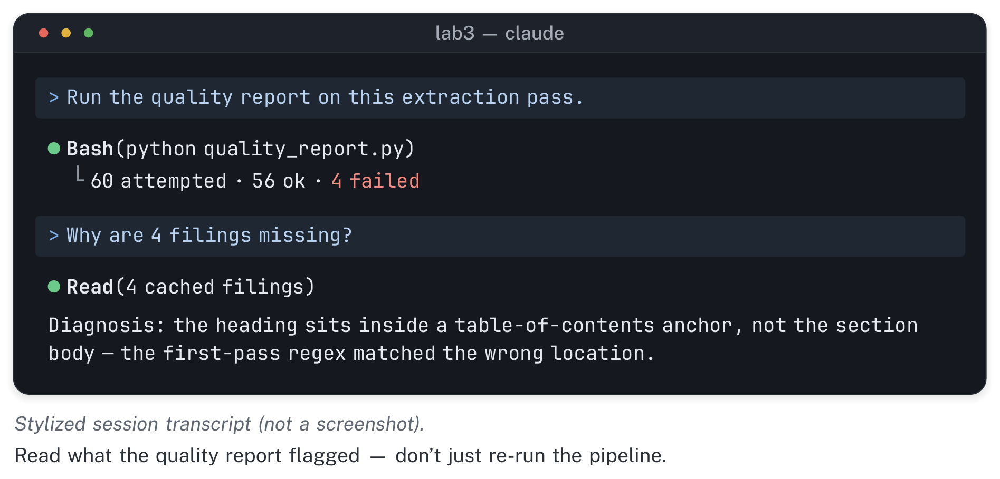
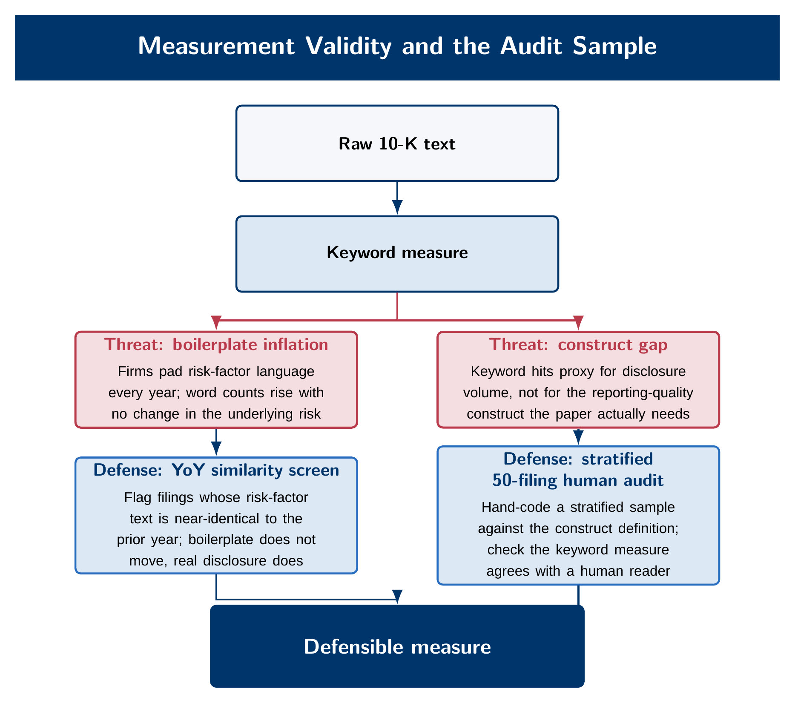
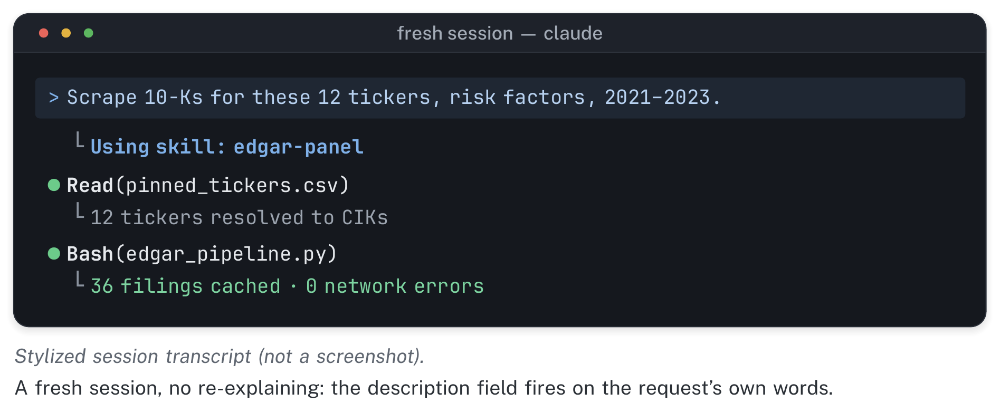

::: {.module-links}
[[]{.bi .bi-play-btn aria-hidden="true"} Video (14 min)](#module-video){.is-primary}
[[]{.bi .bi-file-earmark-pdf aria-hidden="true"} Module 3 slides (PDF)](../assets/slides/day3_slides.pdf)
[[]{.bi .bi-tools aria-hidden="true"} Lab](../labs/day3.qmd)
[[]{.bi .bi-file-earmark-zip aria-hidden="true"} Starter pack (zip)](../assets/labs/lab3_starter.zip)
:::

```{=html}
<div class="module-video" id="module-video">
  <p class="module-video__label" id="module-video-label">
    <span class="bi bi-play-circle" aria-hidden="true"></span>
    Watch: Module 3 walkthrough (14 min, narrated slides)
  </p>
  <div class="module-video__frame">
    <video controls preload="metadata" playsinline
           poster="../assets/video/module3_poster.jpg"
           aria-labelledby="module-video-label">
      <source src="../assets/video/module3_edgar_text.mp4" type="video/mp4">
      <track kind="captions" src="../assets/video/module3_edgar_text.en.vtt"
             srclang="en" label="English" default>
      <p>Your browser cannot play this video.
        <a href="../assets/video/module3_edgar_text.mp4">Download the MP4</a> instead.</p>
    </video>
  </div>
  <p class="module-video__meta">
    <a href="../assets/video/module3_edgar_text.mp4" download>
      <span class="bi bi-download" aria-hidden="true"></span> Download video (MP4, 29 MB)</a>
    <span aria-hidden="true">·</span>
    <a href="../assets/video/module3_edgar_text.en.vtt" download>Captions (WebVTT)</a>
  </p>
</div>
```

Accounting research meets AI most naturally in text. A 10-K's Risk Factors section, its MD&A, and its footnotes are disclosures an agent can fetch, parse, and count at a scale no RA could match by hand. They are also the raw material for measures like "tariff exposure" or "cyber risk disclosure" that show up three sections later in a paper's main table. That same combination makes this the most dangerous module of the course so far. A keyword count is not a construct. Getting from "the filing contains the word 'tariff' eleven times" to "this firm is meaningfully exposed to trade policy risk" is a measurement claim, and measurement claims are where accounting expertise matters most. No amount of agent capability substitutes for knowing what a disclosure measure is supposed to capture and where it can fail to capture it without anyone noticing.

This module has two parts built around one lesson. In the morning you build a real pipeline: CIK resolution, filing retrieval, section extraction, a DuckDB store, and a keyword measure. You build it the way a paper actually gets built. Most of it can be automated, but the last stretch is hard and requires you, not the agent, to look at the failures by hand. In the afternoon, you take everything painful about that pipeline (the retries, the regex fixes, the caching logic you had to get right) and turn it into a `SKILL.md`. A skill is a packaged, reusable procedure that any future session, yours or a coauthor's, can run without you explaining it again. Both parts teach the same lesson. A procedure that took real effort to work out should be written down once, carefully, so that nobody, including you a year from now, has to work it out again.

{fig-alt="Pipeline diagram: CIK resolution, filing retrieval, section extraction, and a DuckDB store, with a quality report attached to each stage."}

::: {.callout-note icon=false}
## Learning objectives

By the end of this module, you should be able to: front-load an EDGAR pipeline prompt with the CIK concept, the rate limit, and the User-Agent requirement, and explain why doing so up front saves iteration time; describe why 10-K section extraction needs a multi-regex fallback rather than a single pattern, and read a quality report to diagnose the difference between a genuine edge case and a fixable regex gap; critique a keyword-count disclosure measure on construct-validity grounds and specify a stratified human-audit protocol you would run before publishing it; explain why a `SKILL.md` description has to be written as a trigger condition rather than a title, and demonstrate the difference on a skill you build yourself; design a paper-reading skill whose notes cite a table and column for every number, and check those numbers against the PDF; and place this module's habits inside the "Show Other People" framing, in which a skill turns something you did painfully once into something nobody on your team has to relearn.
:::

## EDGAR mechanics, and front-loading the facts that matter

EDGAR is public, and that makes this module different from Module 2's FSDS work in one specific way. There is a stable firm identifier, the CIK, a numeric code assigned once and never reused, that every downstream query keys off of. There is also a full-text search endpoint (`efts.sec.gov`) and a per-filer submissions endpoint (`data.sec.gov/submissions/CIK##########.json`), which together get you from "I want Apple's last five 10-Ks" to a list of accession numbers in one request. The SEC also enforces two operational rules that have nothing to do with judgment and everything to do with getting a script working on the first try. You may send no more than 10 requests per second, and every request must carry a `User-Agent` header that identifies you (a name and an email address, not a blank string or a generic library default). Skip the header and the first request returns a 403. Ignore the rate limit on a 20-firm, multi-year pull and you risk a temporary block that costs far more time than the delay you were trying to save.

The biggest time-saver in a module like this is not better code. It is a better first prompt. Compare two ways of asking for the same pipeline. Vague: "get me the risk factors from some 10-Ks." Front-loaded: "Fetch the Item 1A Risk Factors section from the 10-Ks filed by the CIKs in `pinned_ciks.csv`, for fiscal years 2021–2023, using the EDGAR full-text search and submissions endpoints. Respect a 10 request/second rate limit and set the User-Agent header to `<name>@<institution>.edu` on every request. Cache raw filing HTML to `data/filings/` so a re-run never re-downloads a file that already succeeded." The vague version sounds reasonable because it names the goal, but it leaves every operational fact for the agent to discover by trial and error. It will hit the 403, recover, hit the rate limit, back off, and only then start parsing. The front-loaded version puts the facts a domain expert already knows into the prompt before any code is written. The difference shows up as fewer rounds of trial and error, not as a different final pipeline. This runs against the instinct that a shorter prompt is a more efficient one. For any task with known operational constraints, the efficient prompt is the one that states them.

## 10-K anatomy and the case for multi-regex fallback

Every 10-K nominally has an Item 1A (Risk Factors) and an Item 7 (MD&A). In a perfect world, extracting either section would take a single regular expression: find the heading, find the next heading, take everything in between. Filers do not cooperate. Across a real sample of even a few dozen firms you will find "ITEM 1A" in all caps with no punctuation, "Item 1A." with a trailing period, and the item number and the words "Risk Factors" split across a table-of-contents anchor tag and the actual section heading. The case that should worry you most is a filing where the phrase "Item 1A" also appears in cross-references elsewhere in the document, so a naive first match grabs the wrong location entirely. A single regex pattern that works on the first ten firms in your list will often fail silently on the eleventh. Silent failure is the real danger. A section extraction that returns three sentences of boilerplate that happened to sit between two matched headings does not look like an error. It looks like a very short Risk Factors section.

The fix is an ordered fallback chain, not a cleverer single pattern. Try the cleanest pattern first. If it produces a suspiciously short match (say, under some threshold of expected section length), fall through to progressively looser patterns, and log which pattern fired for each filing. That brings us to the module's central number. On this lab's pinned firm list, a first-pass extraction across the pinned CIKs and three fiscal years typically lands around 95 percent success on the first regex pass. That is a good number, and it would look publication-ready if you stopped there. It is not publication-ready. Reading the quality report on the failures (not re-running the whole pipeline, just reading what it flagged) usually turns up a small number of real regex gaps, such as a filer's unusual heading format that the fallback chain hadn't anticipated. A second pattern fixes those and pushes the number to around 99 percent. What is left after that fix is no longer a coding problem. It is one or two filings with a structure far outside the pattern space, such as a heavily reformatted amendment or a filer who nests Item 1A inside an exhibit. A human has to open each of those filings and either hand-extract the section or make a documented decision to exclude it. Automation and iteration get you from 0 to roughly 95 percent, and one targeted fix gets you close to 99. A paper ready for publication hand-checks every remaining failure instead of dropping it from the denominator without saying so.

::: {.callout-warning icon=false}
## Common failure: treating the quality-report number as the deliverable

It's tempting to report "99% extraction success" as if the number itself were the finding. It isn't. The denominator matters as much as the numerator. If the hardest 1% of filings are systematically different from the ones that extracted cleanly (older, smaller filers, unusual corporate structures), a pipeline that silently drops them has a selection problem, not a success rate. Keep a one-line diagnosis for every failure in the quality report rather than discarding it. That record turns "99% extracted" into a defensible claim about your sample, instead of a number that hides which firms didn't make it in.
:::

## Pipeline robustness: cache first, fix, and re-run touches only what's missing

None of the iteration above is affordable if it means re-scraping the entire firm list every time you tweak a regex. What makes it affordable is caching raw HTML to disk on first download, one file per filing with a predictable name, before any extraction logic runs against it. Extraction then becomes a pure function over files already stored locally. Fix the regex, re-run the extraction step, and the pipeline should make zero network requests, because every filing it needs is already on disk. Caching is not an optimization to add later. Treat it as part of the pipeline's first draft, the same way you treated named scripts as non-negotiable in Module 2. Twenty firms times three years at a rate limit of 10 requests per second is a real amount of wall-clock time, and a real exposure to a temporary block if you re-trigger it every time you adjust one pattern.

The second habit that makes iteration manageable is a quality report that runs automatically after every extraction pass. It counts successes and failures, and it flags extractions that succeeded technically but returned a suspiciously short section. A short section usually means the regex matched the wrong heading, not that the firm actually wrote a two-paragraph Risk Factors section. The most useful prompt at this stage is a blunt one. Ask Claude directly why N filings are missing or flagged, and let it read the cached HTML for those cases and report what is structurally different about them. This is the autonomous debugging Module 2 introduced. The agent investigates and proposes a fix. You decide whether the fix is worth making or whether the case goes in the "flag for manual review" pile.

{fig-alt="Mock extraction quality report listing successes, failures with one-line diagnoses, and flags for suspiciously short sections."}

## DuckDB as the research store

Once sections are extracted, they need somewhere to live that you can query without standing up a server. DuckDB fits that need. It is a single file, requires no configuration or running process, and reads and writes from Python, R, or the command line. For this module's pipeline, three tables are enough: `filings` (one row per CIK-fiscal year, with the cached file path and extraction status), `sections` (the extracted text itself, keyed to the filing), and `keywords` (the counts you compute from that text, keyed the same way). You do not need to be fluent in SQL to use it. Describe the aggregate you want in plain English ("give me the total tariff-keyword count by firm, sorted highest to lowest") and let Claude translate that into the query. Then read the query it wrote before trusting the numbers. For an accounting researcher who has spent a career in Stata, the benefit is not SQL fluency. A folder of forty CSVs, one per firm-year and easy to lose track of, becomes one file, `edgar_panel.duckdb`, that any script or coauthor can open and query without asking you which version is current.

## Measurement validity: what makes this an accounting course

In this part of the module, domain expertise does work that no amount of agent capability replaces, and it gets the most careful treatment of anything covered so far. Start with the plainest version of the problem. Suppose your keyword table reports that a firm's 10-K mentions "tariff" fourteen times in its Risk Factors section this year, up from six last year. It is tempting to read that jump as evidence of rising trade-policy exposure. It might be. It might also be almost entirely mechanical: a law firm updated its template, the firm's boilerplate risk-factor language was copied forward with one paragraph inserted, and the firm's economic exposure to tariffs barely changed. A keyword count measures word frequency in a document. "Exposure to trade policy risk" is a construct about the firm's economic situation. The gap between the two is construct validity, and it is not a technicality. It is a common way for a disclosure-based measure to be wrong and still survive peer review: the measure looks reasonable, the coefficient is significant, and nobody checked whether the counted words track the thing being claimed.

Boilerplate is the failure mode to name specifically, because it is both common and detectable. Public filers reuse risk-factor language year over year far more than a first read of "disclosure" suggests. The same law firm drafts filings for dozens of clients, the same paragraph gets carried forward with minor edits, and a keyword count treats a copy-pasted paragraph exactly the same as a rewritten one. The detectable signal is year-over-year textual similarity. Compute a similarity score (Jaccard similarity on shingled text, or cosine similarity on a bag-of-words or embedding representation) between a firm's Risk Factors section this year and the same section last year. A high similarity score alongside a rising keyword count is strong evidence of boilerplate inflation. The count went up because the section got longer or the topic came up once more, not because the underlying disclosure changed in substance. A low similarity score alongside a stable or rising keyword count is closer to what a real disclosure change looks like: the firm rewrote the section, and the keyword signal comes from the new language. Neither pattern settles whether a given measure is valid. They are diagnostics, not proof. But a paper that reports a text-based measure without running this check has skipped a step that referees at serious accounting journals will ask about.

{fig-alt="Diagram mapping measurement threats — boilerplate, mismeasured constructs, unaudited claims — to their defenses: similarity scoring, rubric coding, and a stratified human audit."}

The check that actually settles the question, and the one you cannot delegate, is a human audit sample. Before a text-based measure goes into a paper's main table, someone who understands the construct has to read a sample of the underlying filings and code, by hand, whether the measure means what the paper claims it means. A defensible protocol, as opposed to an ad hoc one, has three parts. First, the sample has to be stratified, not drawn for convenience. Pull filings across the range of the measure (high, middle, and low keyword counts), across firm size, and across the industries in your panel, so the audit doesn't end up checking only the easy cases. Fifty filings stratified this way is a reasonable target for a measure going into a working paper: enough to catch a systematic problem, small enough to finish. Second, code against a written rubric decided in advance. State what counts as "genuine tariff exposure" language versus a boilerplate mention before you start reading, and do not adjust it filing by filing as you go. Third, if more than one person codes any part of the sample, report an inter-rater agreement statistic. If only one person codes it, say so plainly rather than implying a validation step that didn't happen. None of this is optional cleanup to do if time allows. It is the step that turns "we counted a word" into "we have evidence this measure captures what we say it captures," and it is the researcher's job, not the agent's. Claude can build the pipeline that produces the keyword counts and the similarity scores in an afternoon. Only a human who understands the accounting construct can read fifty filings and say whether the number means what the paper claims.

::: {.callout-tip icon=false}
## Verify this: the protocol is the deliverable, not the measure

This module's lab does not ask you to prove your tariff-mention measure is valid. Fifty filings is not enough to prove anything at the scale a real paper would need, and pretending otherwise would be its own validity failure. The lab asks for the protocol you would run before trusting the measure: which fifty filings, stratified how, coded against what rubric, by whom. Write that protocol down in three sentences before you've convinced yourself the number is fine. Of the habits in this module, that one is the most likely to protect a published claim from a referee's construct-validity objection.
:::

## Everything you just did painfully is an SOP

Look back at what the morning required: a front-loaded prompt naming operational facts you had to already know, a fallback chain of extraction patterns built by iterating on failures, a caching layer that made iteration affordable, a quality report you read by hand, and a validity check that only you could run. None of that was a one-time cost specific to this list of twenty firms. It is the standard operating procedure for turning any EDGAR text corpus into a measured panel, and you will want to run it again in three months on a different topic, a different firm list, or a revision a referee requested. The natural instinct is to keep the procedure in your head, or scattered across old chat transcripts and half-remembered prompts. A skill is the alternative: a written instruction set that a fresh Claude Code session can read and execute correctly on the first try, without you explaining any step again.

Researchers who build these procedures for a living describe the purpose of a skill as "Show Other People." A skill takes something you currently re-explain in every new chat and turns it into something any collaborator, now or later, can run without you. For a PhD student managing RAs, the comparison is direct. A skill is the document you would hand a first-year RA on day one, except it never forgets, never words the instructions differently on a bad day, and never leaves when the RA graduates.

## SKILL.md anatomy — and the error almost everyone makes first

A skill is a folder containing a `SKILL.md` file. The file opens with a YAML frontmatter block (a `name` and a `description`), followed by a body that spells out the procedure in steps. The folder can also hold supporting files (templates, reference scripts) that the skill points to. The frontmatter is short, but one field in it decides whether the skill ever runs, and it helps to see that field written wrong before seeing it written right.

Here is the wrong version. It looks completely reasonable the first time you write it:

```yaml
---
name: edgar-panel
description: EDGAR filing tool
---
```

This skill will never fire. The procedure written below it may be fine. The problem is that `description` is not a label. It is the trigger condition an agent matches against to decide whether this skill applies to the current conversation. "EDGAR filing tool" says what the skill is, but it gives the matching logic nothing to recognize in an actual request. A student asks for "risk factor counts for these tickers," and nothing in "EDGAR filing tool" connects to that sentence. The skill sits in the folder, correctly written and never used.

Here is the same skill with the one field rewritten as a trigger:

```yaml
---
name: edgar-panel
description: Use when the user asks to scrape 10-K filings, build an EDGAR text
  dataset, or names a set of tickers or CIKs alongside a form type (10-K, 10-Q)
  and a date range.
---
```

Nothing else about the skill changed. This description names what a real request will actually look like ("scrape 10-Ks," a ticker list plus a form type, a date range), so the matching logic has concrete phrases to recognize. Writing the description as a title is a very common design error in a first skill, which is why the lab demonstrates it rather than just describing it. A title reads as correct and parses as valid frontmatter, but it never triggers. You find out only when you open a fresh session and the skill you were sure you'd built doesn't fire.

{fig-alt="Annotated SKILL.md file: YAML frontmatter with a name and a trigger-condition description, numbered procedure steps, and pointers to supporting files."}

## The five-step workflow for building your first skill

Turning a painful procedure into a working skill follows a short, repeatable sequence. First, notice the repetition. If you are writing essentially the same instructions into a new session for the third or fourth time, that is the signal that something should become a skill. A guess about what you might need later is not. Second, name the inputs precisely. For this module's pipeline, that is a CIK list, a form type, and a fiscal-year range: the parameters that vary from run to run while the procedure itself stays fixed. Third, design the output structure before writing a line of the skill body: a DuckDB file with the schema from earlier, a `metadata.csv` describing what's in it, and a quality report. First attempts often go wrong here, because it is easy to describe the steps and skip specifying what the skill should leave behind when it finishes. Fourth, let Claude draft the `SKILL.md` itself from a one-paragraph spec covering the points above. A skill is code, and Claude is generally good at writing it once you have done the harder work of deciding what it should do. Fifth, test-fire it in a fresh session, not the one where you built it, on two firms you didn't use while developing the skill. Confirm it produces the output structure you specified without you explaining anything again.

{fig-alt="Mock session where a natural request matches a skill's trigger description and the packaged procedure runs without re-explanation."}

Two notes on scope. A skill can live at the project level (`.claude/skills/`, checked into your project's git repository, so a coauthor who clones the repo gets it automatically) or globally (`~/.claude/skills/`, available in every project on your machine). The rule of thumb: use project scope for anything tied to one paper's pipeline, and global scope for something you'll use across many projects regardless of topic, such as a writing-style skill rather than a firm-specific data pipeline. Getting this wrong costs context, not correctness. Every globally installed skill's description loads into every session you open, whether or not that session needs it. A global folder full of narrow, project-specific skills uses up context in every unrelated conversation you have from then on.

The description is the only part that is always loaded. The body of `SKILL.md` loads when the skill is used, and supporting files load only when a step points to them. That is why a long procedure costs little sitting in a skill and a lot sitting in CLAUDE.md. A skill is also reactive. It runs when a request matches its description or when you call it by name; it does not watch your project or run on a schedule. A job that has to happen on its own, such as a nightly data refresh, needs a scheduled task or a hook instead.

## A second skill: reading a paper the same way every time

The EDGAR skill packages a data pipeline. The same idea works for a task you do even more often: reading a paper. A PhD student reads dozens of empirical papers a term, and the notes are usually uneven. One paper gets a careful account of its identification; the next gets two lines about the result. A paper-reading skill fixes the format, so every paper you read produces the same set of notes:

- **Question:** what the paper asks, in one sentence.
- **Setting:** the institutional detail the design depends on, such as the regulation, the market, or the reporting rule.
- **Sample:** data sources, years, filters, and the N after each filter, with the table where each N appears.
- **Identifying variation:** what changes for some firms and not others, and why that variation is plausibly unrelated to the outcome.
- **Main result:** the headline coefficient and standard error, with table and column, and what the magnitude means in economic terms.
- **Replication:** whether you could get the data, and which parts of the analysis you could rebuild.

The description should name the requests it is for: "Use when the user asks to read, summarize, or take notes on an academic paper (a PDF, or an SSRN or arXiv link), or asks what a paper's identification strategy or main result is." The output should be a notes file on disk, one per paper, so your reading accumulates into something you can search later instead of disappearing with the chat.

Long PDFs need one extra step. A 60-page paper with an online appendix takes up a large share of the context window, so have the skill split the PDF into sections, read them in order, and write the notes as it goes. Scott Cunningham's [`split-pdf` skill](https://github.com/scunning1975/MixtapeTools) does this splitting, and Alessandro Spina's skills brownbag, listed on the [Resources](../resources.qmd) page, includes a paper-review skill built around an identification-first template like the one above.

The verification step matters more here than almost anywhere in the course. Numbers summarized from a PDF are easy to get wrong: an N taken from an earlier filter step, a coefficient from the wrong column, a robustness estimate reported as the main result. The notes read just as fluently when a number is wrong. So the skill must cite a table and column for every number it reports, and you check each one against the PDF before the notes go into your literature file. Check every number the first few times you use the skill, until you know how often it slips.

## The bridge to Module 4

Your text panel keys everything to CIK. Firm fundamentals (assets, leverage, R&D spending) live in Compustat, keyed to `gvkey`, and the two do not speak to each other without a crosswalk. That crosswalk exists on WRDS. In the next module you'll use it from your own account, through an MCP server that lets Claude query Compustat without your password ever entering the conversation. This module's pipeline gives you CIKs. Module 4's lab links those CIKs to their financial statements.

From here, head to [this module's lab](../labs/day3.qmd) to build the pipeline, run the validity check, and write your first skill. Two mantras from Module 1 apply directly here. **Trust, but verify** now means reading fifty filings by hand before you trust a text measure. **Files persist, context doesn't** is the reason to write a `SKILL.md` instead of re-explaining the same procedure next month.
