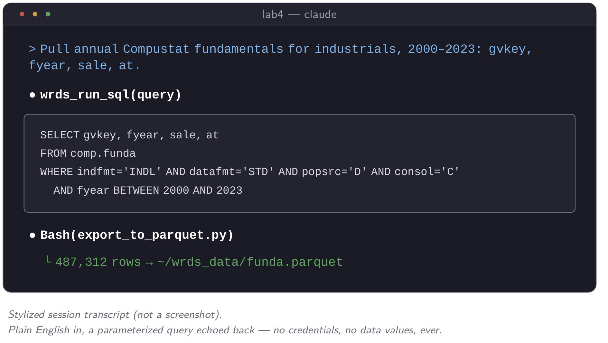
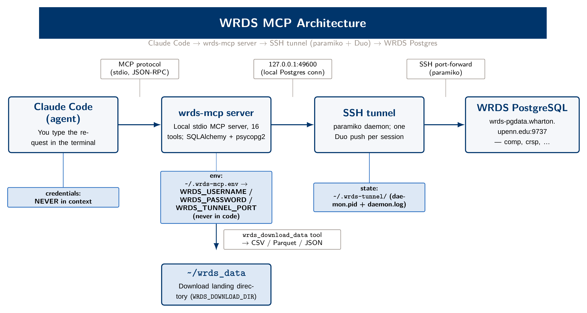
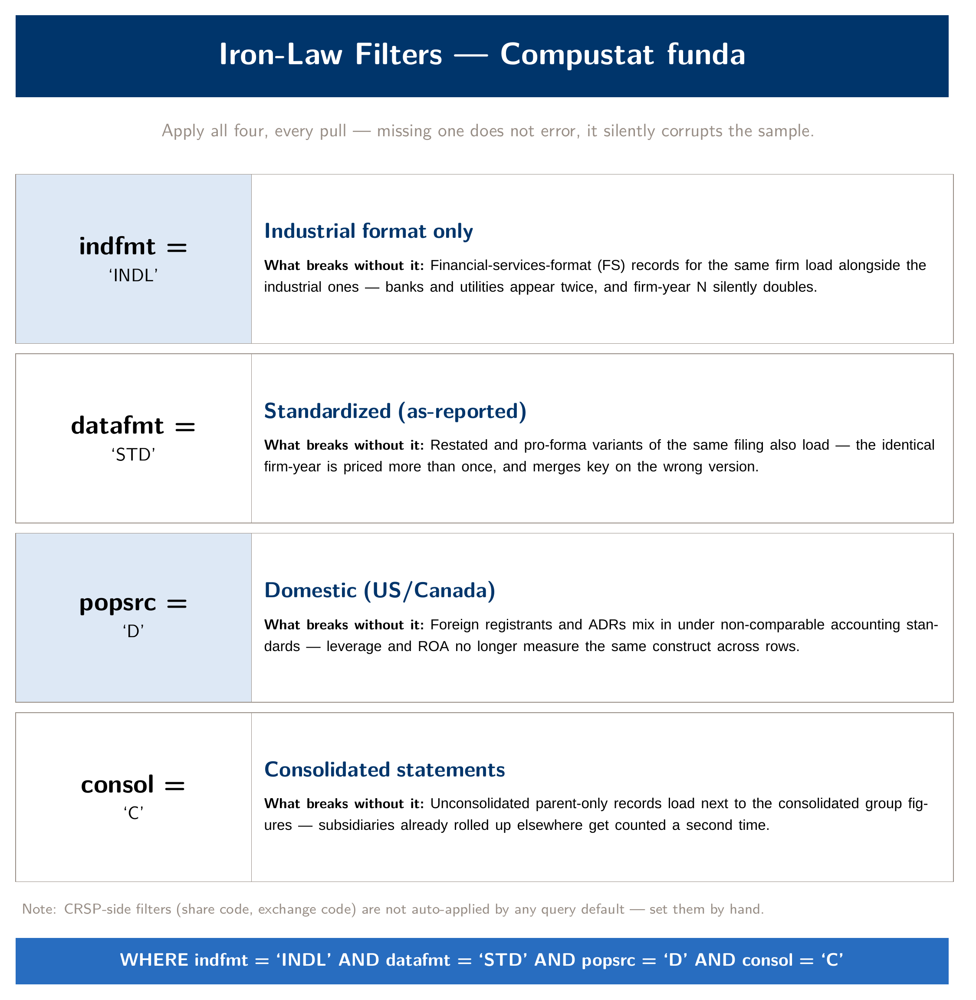
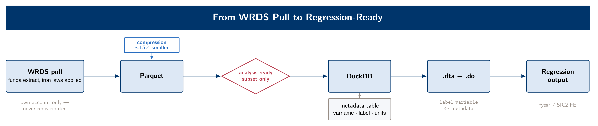

::: {.module-links}
[[]{.bi .bi-play-btn aria-hidden="true"} Video (14 min)](#module-video){.is-primary}
[[]{.bi .bi-file-earmark-pdf aria-hidden="true"} Module 4 slides (PDF)](../assets/slides/day4_slides.pdf)
[[]{.bi .bi-tools aria-hidden="true"} Lab](../labs/day4.qmd)
[[]{.bi .bi-file-earmark-zip aria-hidden="true"} Starter pack (zip)](../assets/labs/lab4_starter.zip)
:::

```{=html}
<div class="module-video" id="module-video">
  <p class="module-video__label" id="module-video-label">
    <span class="bi bi-play-circle" aria-hidden="true"></span>
    Watch: Module 4 walkthrough (14 min, narrated slides)
  </p>
  <div class="module-video__frame">
    <video controls preload="metadata" playsinline
           poster="../assets/video/module4_poster.jpg"
           aria-labelledby="module-video-label">
      <source src="../assets/video/module4_wrds_mcp.mp4" type="video/mp4">
      <track kind="captions" src="../assets/video/module4_wrds_mcp.en.vtt"
             srclang="en" label="English" default>
      <p>Your browser cannot play this video.
        <a href="../assets/video/module4_wrds_mcp.mp4">Download the MP4</a> instead.</p>
    </video>
  </div>
  <p class="module-video__meta">
    <a href="../assets/video/module4_wrds_mcp.mp4" download>
      <span class="bi bi-download" aria-hidden="true"></span> Download video (MP4, 32 MB)</a>
    <span aria-hidden="true">·</span>
    <a href="../assets/video/module4_wrds_mcp.en.vtt" download>Captions (WebVTT)</a>
  </p>
</div>
```

Module 3 ended with the filing text parsed and each firm identified by its CIK. The next step is to attach fundamentals (leverage, profitability, size) to every firm-year in the panel. Those fundamentals live in Compustat and CRSP, and unlike EDGAR text they are not available as a public bulk file. Three barriers stand in the way: authentication (a licensed WRDS account behind MFA), licensing (a subscription your institution pays for, which you may not redistribute), and scale (Compustat's full annual file has hundreds of variables and decades of history, far more than you can read into a chat window). A plain chat tool cannot get past any of the three. This module's stack handles all three in order, and you will watch it work on a real account with real data.

The module is organized around those three problems. An MCP server solves *access*: the protocol handles WRDS authentication, so your credentials never enter the conversation with Claude, no matter how many queries you run. Iron-law filters and mandatory inspection solve *correctness*. A query that runs without an error is not the same as a query that returns the right rows, and Compustat in particular will return plausible-looking but wrong rows if you skip a filter. Parquet, DuckDB, and a metadata table solve *scale and memory*; they apply Module 1's central fact, that files persist and context doesn't, at the data layer. By the end, a plain-English request turns into a correctly filtered `funda` extract on your own account. Be careful at that point. When the query works, the problem feels solved, and that is when you are most likely to trust a result you have not checked.

::: {.callout-note icon=false}
## Learning objectives

By the end of this module you should be able to: describe what an MCP server does and why `wrds-mcp` is different from a hand-rolled SQL script; sketch the full connection chain from Claude Code to WRDS Postgres and name where credentials live at every hop; run the venv install, `.env`, and Duo-tunnel ritual from a cold start, including teardown; explain why data governance is not the same thing as sandboxing, and state the course's zero-WRDS-distribution rule in your own words; recite the four Compustat iron-law filters and what each one breaks, without any error, if you skip it; run the four mandatory inspection checks on any WRDS extract before you report a number from it; convert a CSV extract to Parquet, query it lazily in DuckDB, and explain why "filter first, never `SELECT *`" is a hard rule at this scale; build a metadata table that documents a dataset's variables and use it to orient a fresh Claude session; explain what a sub-agent is, when splitting work across parallel sub-agents pays off, and why its summary still needs checking; use an independent Python–Stata replication of the same regression as a verification check, and explain why standard errors can legitimately differ; and use the feasibility-assessment prompt pattern before attempting any nontrivial pull or linkage task.
:::

## What an MCP actually is

Model Context Protocol (MCP) works like this. Instead of you writing and maintaining the plumbing that connects an AI agent to an external service (the connection handling, the authentication, the query submission, the error translation), a small dedicated server does that job. The agent talks to the server through a standard protocol instead of talking to the service directly. `wrds-mcp` is such a server for WRDS. It is a Python package that runs as a local process and exposes a fixed set of named tools: `wrds_list_libraries`, `wrds_describe_table`, `wrds_run_sql`, `wrds_download_data`, and a handful of pre-built helpers for CRSP, Compustat, and the CRSP–Compustat merge, sixteen tools in the current version. It reads your WRDS credentials from the environment, never from a line of code and never from the conversation.

Compare this with a hand-rolled `psycopg2` script that opens a direct Postgres connection to WRDS. That script is a reasonable thing to write, and plenty of researchers do. The cost comes when you want Claude to use it. You would have to paste a password into a script, or into an environment variable Claude reads and could in principle echo back into a response. You would also have to write the SSH/Duo handling yourself, from scratch, correctly, under time pressure. With MCP, the server is the only thing that ever touches your WRDS password. Claude issues a plain-language request; the MCP server translates it into a parameterized SQL call, or invokes one of its pre-built helpers, and returns rows. Your credentials never enter the prompt or the model's context window, because nothing in the interaction requires them.

{fig-alt="Mock session showing a plain-English data request and, below it, the parameterized SQL that wrds-mcp actually issues."}

For the rest of this module, remember that the protocol carries authentication for you, so your credentials never appear in the conversation.

MCP also completes Module 1's tool ladder. Claude Code without any MCP servers sits at the fourth rung: filesystem access and local execution. Connecting it to an external, authenticated service through a protocol like this is the fifth rung, and everything in this module happens on that rung.

## The architecture, one hop at a time

{fig-alt="Architecture diagram of four hops: Claude Code, the wrds-mcp server, a paramiko Duo tunnel on local port 49600, and WRDS PostgreSQL, with credentials touching only the server's environment file."}

The full chain has four links. The lecture spends time on this figure because the right mental model prevents a common confusion later: assuming that Claude has your WRDS password because Claude can pull WRDS data. It does not, at any point.

**Link one: you, typing a plain-language request into Claude Code.** You never type a password here. You type something like "pull annual Compustat fundamentals for industrials, 2000–2023, gvkey/fyear/sale/at/dltt/ni."

**Link two: the `wrds-mcp` server**, a local process running from `~/.wrds-mcp-env/bin/wrds-mcp`. It receives the request over the MCP protocol (stdio and JSON-RPC; you don't need to memorize the mechanics, only that it is a defined local channel, not the open internet). It reads `WRDS_USERNAME`, `WRDS_PASSWORD`, and `WRDS_TUNNEL_PORT` from environment variables stored in a file on your disk (`~/.wrds-mcp.env`). They are never hardcoded, never printed, and never part of the conversation Claude sees. Internally the server uses SQLAlchemy and `psycopg2` to build and issue the actual SQL.

**Link three: the persistent Duo tunnel**, a background daemon (`tunnel_daemon.py`) that uses **paramiko**, a pure-Python SSH library, to open one keyboard-interactive SSH session to the WRDS-cloud bastion, approve a single Duo push, and hold that session open indefinitely. Pay attention to this detail. WRDS's bastion accepts only keyboard-interactive authentication, which is how Duo is delivered, and `sshpass` does not support keyboard-interactive auth. If you see an old doc telling you to `brew install sshpass`, ignore it; paramiko is already a dependency of the package and handles this correctly. The daemon listens on **local port 49600** and forwards everything on `127.0.0.1:49600` through the SSH tunnel to WRDS's Postgres endpoint. You approve Duo once, at tunnel start, and every query for the rest of the session reuses that approved connection. That can be dozens of queries if Claude is working through a multi-step pull.

**Link four: WRDS PostgreSQL itself**, a database cluster with schemas like `comp` (Compustat), `crsp`, `tr_insiders`, `trace_enhanced`, and more, gated by your institution's subscription.

Students often get the next point backwards. Sandboxing the agent's execution environment (a Docker container, a restricted shell) controls what Claude can *do*. It does nothing to control what Claude can *see* once data is in front of it; a mounted file is readable whatever container it sits in. What keeps your WRDS password away from Claude is that it never enters the chain where Claude operates. It lives in an environment file the MCP server reads directly, one link below Claude's language-level reasoning. Access is controlled by the architecture, not by a sandbox. The governance section below returns to this distinction in more detail.

Query results land on your disk in **`~/wrds_data`** by default (set the `WRDS_DOWNLOAD_DIR` environment variable if you ever need to point it elsewhere). They do not land in Claude's context, and they are not printed in full into the transcript. Claude sees a summary (a shape, a `.head()`, a row count), the same discipline Module 1 taught you to apply to any large file.

## Ritual and hygiene: the boring parts that save you

Everything above works only if a short list of routine habits happens in order, every session. None of it is hard. All of it gets skipped under time pressure, which is why this module drills it instead of assuming one read of the setup page is enough.

Install `wrds-mcp` into its own virtual environment, not your system Python or an environment you use for other work: run `python3 -m venv ~/.wrds-mcp-env`, then `pip install -e .` from inside the package directory. Keep credentials in a private env file, never hardcoded in a script and never typed into a prompt. Copy `.env.example` to `~/.wrds-mcp.env`, fill in your own username and password, and set the file's permissions so only you can read it (`chmod 600`). If you're working inside a git-tracked project directory (by now you probably are), write the `.gitignore` entry for any credential file *before* you create the file. A `.gitignore` written afterward protects you only if you remember to write it before your next `git add .`. One written first protects you by default.

The tunnel ritual has a strict order: **up, work, teardown.** Source your env file, run `tunnel_up.sh`, approve the single Duo push within about thirty seconds, confirm the daemon reports it is listening on port 49600, and only then open Claude Code or issue your first query. At the end of every session, run `tunnel_down.sh`. This is the step people skip most often, because nothing visibly breaks if you don't do it; the tunnel stays open until you close your laptop or it drops on its own. Skipping teardown is not as serious as skipping an iron-law filter, but it is sloppy: an open tunnel is an authenticated session to a licensed institutional resource, left open for no reason. This module's verify checklist puts tunnel teardown as its last item on purpose, so that it is the last thing you check before you finish, rather than something you notice days later.

::: {.callout-warning icon=false}
## Common failure: pasting a password into the prompt "just this once"

The hardest mistake to undo is typing your WRDS password directly into a message to Claude. People do it as a shortcut, to "just get it working," or because a script errored and pasting the credential felt faster than fixing the environment variable. Once a credential has been typed into a conversation, it has been sent to the model, and no cleanup afterward fully undoes that. The fix is procedural: credentials go in `~/.wrds-mcp.env`, full stop. If a script can't find them, check that the env file is sourced. Never substitute a hardcoded value to move faster.
:::

## Governance is not sandboxing

The distinction from the architecture section applies well beyond WRDS, and Module 5 returns to it in more depth. Running an agent inside a restricted execution environment (a container, a locked-down shell, a permissions-limited account) constrains what that agent can *do*: which commands it can run, which processes it can spawn, which parts of the filesystem it can write to. It does almost nothing to constrain what the agent can *see* once data has been placed in front of it. A CSV mounted into a sandboxed container is as readable by an agent inside that sandbox as one sitting on your desktop. The sandbox limits action, not visibility.

For that reason, the course's rule for WRDS credentials is architectural rather than a matter of Claude's good behavior. Your password is safe because it never enters the conversation, not because Claude exercises good judgment. WRDS *data*, as opposed to WRDS *credentials*, is governed by a legal constraint rather than an architectural one. Your WRDS subscription is a license held by your institution. It grants *you*, personally, the right to query and use the data for your own research. It does not grant you the right to redistribute extracts, post them, commit them to a shared or public repository, or give them to someone without their own valid WRDS access. This course's hard rule follows directly: **zero WRDS data distribution, anywhere, ever**. That means not in a lab starter zip, not on this website, and not in a shared Slack channel. Every pull in this module's live track happens on your own account, lands in your own `~/wrds_data`, and stays there. The fallback track in the lab is not a workaround for this rule. It uses a separate, 100% public data source, built so that nothing WRDS-derived ever needs to circulate for the class to work.

## The iron laws: four filters, mandatory every time

{fig-alt="Card listing the four Compustat filters — indfmt INDL, datafmt STD, popsrc D, consol C — each with what silently breaks if it is omitted."}

In Module 3 you learned the anatomy of a skill: a packaged, reusable procedure with a checklist a session can load automatically. Here you see a skill used for enforcement. The WRDS filter skill in this course's skills catalog encodes the four filters below as a machine-checkable list that ships with every WRDS session, so that "I forgot the filter" is no longer a plausible excuse. It is the same skill anatomy from Module 3, not a new concept.

Pulling `comp.funda` or `comp.fundq` (Compustat's annual and quarterly fundamentals tables) without all four of the following filters does not produce an error. The query runs cleanly and returns rows that look reasonable, which is why the omission is dangerous.

```sql
WHERE indfmt  = 'INDL'   -- industrial format only
  AND datafmt = 'STD'    -- standardized data
  AND popsrc  = 'D'      -- domestic population source
  AND consol  = 'C'      -- consolidated statements only
```

Drop `indfmt = 'INDL'` and your "industrial firm" sample takes in financial companies reported under the financial-services format. Banks and insurers have balance sheet structures that distort any leverage or asset-turnover measure you compute across the pooled sample. Drop `datafmt = 'STD'` and Compustat's other data formats for the same filing, such as restated or summary versions, load alongside the standardized records, so the same firm-year appears more than once and the same variable name no longer means the same thing across rows. Drop `popsrc = 'D'` and non-domestic population sources enter a sample you meant to restrict to U.S. filers. Drop `consol = 'C'` and unconsolidated subsidiary statements appear as separate rows alongside their parent's consolidated statement. That duplication raises no error. It shows up as wrong regression coefficients three steps downstream, where it is much harder to trace back to its source.

CRSP works differently. **CRSP's filters are not applied automatically by any tool in this stack, including the `wrds_get_crsp_returns` helper.** The helper joins the returns file to the names file on permno and a name-date range and does nothing more. Share-type and exchange restrictions (the modern CRSP v2 equivalent of the old `shrcd IN (10, 11)` convention) are something you apply yourself, as a filter step after the pull, every time. CRSP has no iron-law list to fall back on. You need to know that this is a manual step and not assume a pre-built helper has done it for you.

Both cases teach the same habit: **identify which filters apply, validate that your query includes them before you execute, execute, then inspect.** Follow that order every time, including for "a quick test." A quick test that skips a filter and happens to look fine has not validated anything. It got lucky once.

## Inspect before you trust: the Rationalization Table

A query that executes without an error has not thereby returned the correct data. This module's checks exist to close the gap between those two claims. Four checks are mandatory after every WRDS pull, before you tell anyone, including yourself, that the extract is good: a row count, compared with what you expected rather than just glanced at; a `.head()` or `.sample()` look at the actual values, not just the column names; a null check on the columns you plan to use; and a date-range check (`min`/`max` of `fyear` or `datadate`) against what the query should have returned. None of these is difficult, and all four together take under a minute. Skipping them is a common way for a bad extract to become a published number.

During lecture the instructor projects a short list called the Rationalization Table: the sentences people tell themselves right before they report a number they didn't check.

| What you tell yourself | Why it's a rationalization, not a check |
|---|---|
| "It ran without an error." | No error means the SQL was syntactically valid. It says nothing about correctness, filters, or joins. |
| "The row count looks about right." | "Looks about right" is not a comparison with an expected number you wrote down before running the query. |
| "I've pulled this table before, it's probably fine." | Prior experience with a table doesn't verify *this* query, on *this* date range, with *these* filters. |
| **"The query worked, so it's correct."** | **The most dangerous one on this list.** It treats "executed successfully" and "returned correct data" as a single claim. They are two separate claims that feel the same when the query finishes. |

Remember the last row. Calling a result correct because the query didn't error is not verification at all, even though from the outside it can look like verification. The standard this course holds you to, in this module and every module after, is the one Module 1 introduced for any agent-produced output: delegate the pull, but verify the result, with actual numbers written down, before you build the next step on top of it.

## Scale discipline: filter first, never `SELECT *`

{fig-alt="Flow diagram: a filtered SQL extract converts to a Parquet file, DuckDB queries it lazily, and a narrow analysis-ready table exports to Stata as .dta."}

Compustat's full annual file runs to several hundred variables across decades of history for tens of thousands of firms, and the full CRSP daily file is bigger still. Never try to load either one whole into a pandas DataFrame, and never ask Claude to read either one directly into the conversation. Module 1 warned against doing that with any large CSV. The same context-window mechanics apply here, and the mistake costs far more with this data source.

Two rules work together. First, **filter at the database, not in pandas**. A `WHERE` clause that restricts by `fyear`, by the iron-law filters, and by an explicit list of gvkeys or a SIC-code range does the work at the source, before a single row crosses the wire. Second, **never `SELECT *`, ever, in a script that touches a WRDS table**; name the columns you need. `SELECT *` on a table with hundreds of columns adds an unnecessary and unbounded cost to every query. When you see it in someone else's script, it also tells you they didn't stop to think about which variables they needed.

Once a filtered, column-limited extract lands on disk, convert it to **Parquet** rather than leaving it as CSV. Parquet is column-oriented and compressed, and a wide, mostly numeric fundamentals table is the case it handles best. In this course's own test conversion, a CSV export of a filtered Compustat extract that ran to roughly 1.7 GB compressed to about 114 MB as Parquet. You can reproduce numbers like these yourself on the public fallback sample instead of taking a vendor's claim on faith. Query the Parquet file with **DuckDB**, which evaluates lazily: it reads only the columns and row groups a query touches instead of loading the whole file into memory first. In practice, `SELECT gvkey, fyear, sale, at FROM funda WHERE fyear >= 2000` runs fast and cheaply against a Parquet file, and the same query against a raw CSV loaded fully into pandas does not.

## Metadata as context engineering

A metadata table applies Module 1's first mantra (files persist, context doesn't) to Compustat's opaque variable names. `dltt`, `che`, `csho`, `prcc_f`: none of these is self-explanatory. A fresh Claude session, or a coauthor opening your project for the first time, cannot know that `dltt` means long-term debt in millions of dollars unless something on disk says so.

The fix is a metadata table that you build once and query from then on. It is a small DuckDB (or Parquet) table with one row per variable you use, recording its name, a plain-language label, its units, and a screening note. Without it, that information lives only in your head or in a comment you forgot to write. `SELECT * FROM compustat_metadata WHERE varname = 'dltt'` should return something like "long-term debt, total, in millions of dollars, screen: `> 0` only where you're computing a leverage ratio that requires positive debt." A fresh session can read that sentence and act on it immediately, the same way it reads a CLAUDE.md at the start of a project.

In the demo, after building the metadata table, the instructor closes the session and opens a new one, then orients the new session with nothing but `SELECT * FROM metadata`. There is no re-explanation and no re-pasted variable list. The table on disk brings a session with no memory of the prior conversation up to speed. That is the reason to write state to files instead of relying on context. The metadata table survives compaction and a new session, which a conversation does not, and it survives handing the project to a coauthor who never saw your original prompts.

## Feasibility-assessment prompting: ask before you build

The last habit of the module is a prompt pattern. Learn it by its exact wording rather than a paraphrase, because this phrasing reliably gets Claude to raise blockers *before* it commits to a build, instead of discovering them mid-pull:

> "I want a firm-year panel with leverage and ROA for US industrials 2000–2023 from funda. Tell me what's involved before you try anything complicated. What might be missing?"

The prompt does not ask Claude to write the query yet. It asks Claude to reason about the task first (which filters apply, which variables are needed, where the CRSP–Compustat link might introduce duplicate rows, whether the date range crosses a known Compustat data-format transition) and to report what it finds *before* any SQL runs. In the live demo, this prompt raises the filter question and the linking-table caveat before a single row is pulled, so those issues come up at the start rather than mid-pull. The pattern applies beyond this module. Whenever a task is complex enough that surprises are plausible (a classification task, a linkage across datasets, anything with more than one moving part), asking "tell me what's involved before you try anything complicated" costs less than finding a problem three steps into a build you then have to undo.

## Sub-agents: delegating a piece of the work

Module 2 promised to come back to sub-agents, and they belong in this module because scale is the problem they solve. A sub-agent is a separate Claude instance that the main session launches to do one bounded job. It gets its own fresh context window, does its work there (reading files, running queries, searching), and hands back a single written summary. All the intermediate output stays inside the sub-agent's context and is gone when it finishes. Only the summary enters your main conversation.

The reasoning is the same as in the rest of this module: files persist, context doesn't. Profiling twenty years of a fundamentals extract, or reading forty 10-K risk-factor sections, produces a lot of output, and most of it you never need to see. Run that job in the main session and its output uses up the context budget you need for the analysis itself. Run it in a sub-agent and you get back a one-page answer, with your main session's context almost untouched. And because sub-agents are independent of each other, Claude Code can run several at once: one per fiscal-year block, one per industry, one per filing batch.

You can ask for this directly, in plain English: "Use three sub-agents in parallel. Each one profiles one decade of `funda.parquet` — row counts, missing `at` and `sale`, duplicate gvkey-fyear pairs — and writes its results to `checks/profile_<decade>.md`. Then compare the three files." Claude Code also ships built-in sub-agent types (a read-only one for searching a codebase, a general-purpose one for multi-step work), and you can define your own as a short Markdown file in `.claude/agents/`, with a description of when to use it, the tools it may touch, and its standing instructions. Type `/agents` in a session to see and manage them.

**A sub-agent does not see your conversation.** It starts with only the task description the main session writes for it. The iron-law filters you agreed on three turns ago, the decision to drop financials, the note that firms with fiscal years ending January through May get the prior year's `fyear`: if they exist only in the chat, the sub-agent does not know them. This is another reason to keep a metadata table and a project CLAUDE.md. Rules written to disk can be handed to a sub-agent ("read `compustat_metadata` and `CLAUDE.md` before you query anything"); rules that live only in the conversation cannot.

**A sub-agent's summary is a claim, not evidence.** You see the report, not the work. "All three decades look clean, no duplicates" is the kind of sentence the Rationalization Table above warns about, and it arrives as a summary with the evidence already removed. Have each sub-agent write its actual numbers to a file, as in the prompt above, and spot-check one of those files yourself before you trust the comparison. Delegating the work does not lower the verification standard. If anything, you need to check more carefully, because there is now one more layer between you and the rows.

As a rule of thumb, use sub-agents when a job splits into independent pieces, or when it would produce a lot of output you don't need to read. Skip them for small, sequential tasks where each step depends on the last. There, a single session is easier to follow, and the extra launch and handoff cost time and tokens without any benefit.

## Two languages, one answer

The Stata bridge at the end of the lab gives you a cheap verification check that does not depend on WRDS. Ask Claude to write the same regression twice, once in Python and once in Stata, as two separate scripts, each built from the description of the model and not from the other script. Then compare the coefficients. Two independent implementations of a fixed-effects OLS regression on the same `.dta` file should agree to at least six decimal places. When they do, a whole class of bugs is ruled out at once: a mis-specified fixed effect, a merge that duplicated rows in one pipeline and not the other, a variable built with the wrong sign. When they don't, one of the scripts has a problem, and the mismatch tells you where to look.

Standard errors are a different matter. Packages make different default choices about small-sample corrections, how singleton groups are handled, and how clustered errors adjust degrees of freedom, so standard errors can disagree in the third decimal even when both scripts are right. Not everything has to match. Every difference does have to be explained, by a named default you can point to in the documentation, before you trust either number.

The habit comes from Scott Cunningham's Claude Code series on his *Causal Inference* Substack, where he ran one difference-in-differences estimator through six packages across R, Python and Stata, with identical specifications and data, and got different numbers ([Claude Code 31, March 2026](https://causalinf.substack.com/p/claude-code-31-apple-to-apple-audit)). For accounting students the check has a second benefit. Stata still dominates JAR, JAE and TAR replication packages, so the Python version is both a bug check and a portable copy of your code.

## Where this module leaves you

By the end of the live demo you will have watched a plain-English request become a correctly filtered `funda` extract on the instructor's own account. The extract is inspected with real numbers, converted to Parquet, queried lazily in DuckDB, and documented in a metadata table that a fresh session can read cold, and the tunnel is torn down on camera at the end. The lab gives you the same pipeline on your own account if your WRDS/Duo setup is ready, or on an equivalent public dataset if it isn't. You leave with the same skills either way, because what you are learning is the procedure, not the data source.

From here, go to the [WRDS MCP Setup](../setup-wrds.qmd) page to install and verify your own connection before lab, and to [this module's lab](../labs/day4.qmd) for the two-track exercise itself. The [Verification](../verification.qmd) page has this module's inspection checks added to the protocol card you started in Module 1.
