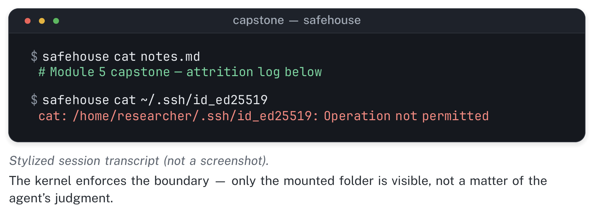
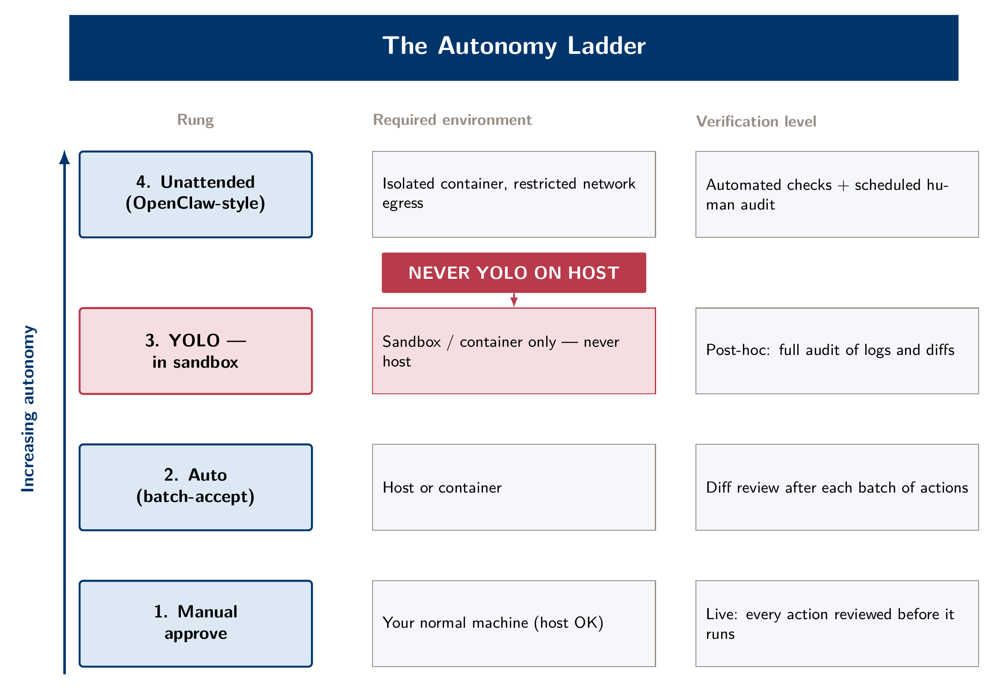
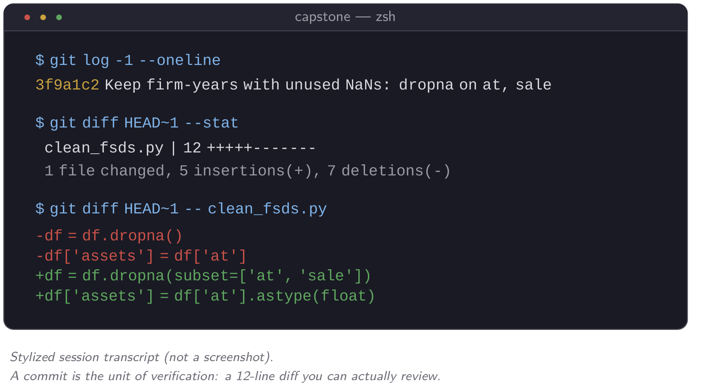

```{=html}
<div class="module-banner"></div>
```

::: {.module-links}
[[]{.bi .bi-play-btn aria-hidden="true"} Video (19 min)](#module-video){.is-primary}
[[]{.bi .bi-file-earmark-pdf aria-hidden="true"} Module 5 slides (PDF)](../assets/slides/day5_slides.pdf)
[[]{.bi .bi-tools aria-hidden="true"} Lab](../labs/day5.qmd)
[[]{.bi .bi-file-earmark-zip aria-hidden="true"} Starter pack (zip)](../assets/labs/lab5_starter.zip)
:::

```{=html}
<div class="module-video" id="module-video">
  <p class="module-video__label" id="module-video-label">
    <span class="bi bi-play-circle" aria-hidden="true"></span>
    Watch: Module 5 walkthrough (19 min, narrated slides)
  </p>
  <div class="module-video__frame">
    <video controls preload="metadata" playsinline
           poster="../assets/video/module5_poster.jpg"
           aria-labelledby="module-video-label">
      <source src="../assets/video/module5_writing_verify.mp4" type="video/mp4">
      <track kind="captions" src="../assets/video/module5_writing_verify.en.vtt"
             srclang="en" label="English" default>
      <p>Your browser cannot play this video.
        <a href="../assets/video/module5_writing_verify.mp4">Download the MP4</a> instead.</p>
    </video>
  </div>
  <p class="module-video__meta">
    <a href="../assets/video/module5_writing_verify.mp4" download>
      <span class="bi bi-download" aria-hidden="true"></span> Download video (MP4, 43 MB)</a>
    <span aria-hidden="true">·</span>
    <a href="../assets/video/module5_writing_verify.en.vtt" download>Captions (WebVTT)</a>
  </p>
</div>
```

Every module in this course has ended with an artifact, such as a script, a figure, a SKILL.md or a Stata extract, that Claude Code helped you build faster than you would have built it alone. This module is about two things that decide whether that speed was worth having. The first is whether the words around those artifacts are actually yours. The second is whether a coauthor, a referee or you a year from now could pick up the repo and trust it without redoing the work. The morning is about the writer: where delegating to an agent sharpens your thinking, and where it replaces it without your noticing. The afternoon is about the record: the sandboxes, credential habits, paper trails and git discipline that make a fast pipeline one you can defend. The capstone lab asks you to take a pipeline you built earlier in this course and make it hold up under both kinds of scrutiny at once.

::: {.callout-note icon=false}
## Learning objectives

By the end of this module, you should be able to: apply the "can you discuss it without the LLM?" test to catch cognitive offloading in your own writing; classify a writing task as banal (delegate) or meaningful (protect) and state a personal delegation rule; use the editor-not-rewriter prompt to get LLM feedback without surrendering authorship; run a clean-room referee that sees only your draft and writes its report to disk; audit a response letter claim by claim against the manuscript and the commit history; place a research task on the verification-debt 2×2 and explain why more autonomy makes unchecked work pile up faster; run the two-command credential audit and know what to do if it fails; write `settings.json` permission rules and a blocking hook, and say which configuration mechanisms request behavior and which enforce it; explain why documentation tells you where to look but does not prove the work was done, and how to check a DECISIONS.md claim against the actual commit history; and use the five core git commands well enough to treat a commit as the unit of verification.
:::

## Writing as thinking, and the loop that undoes it

Start from a claim worth taking seriously: writing is not just how you report your thinking. Much of the thinking happens while you write. If you can't get a sentence to work, you usually haven't worked out the argument behind it yet, and the discomfort of drafting is often part of the work. Handing that discomfort to an LLM saves more than typing time. It can also hand off the reasoning that the typing was forcing you to do.

This failure is hard to notice while it is happening. You give the model a vague prompt, such as "help me explain why this identification strategy is credible." It produces something fluent and plausible, and you read it, agree, and paste it into the draft. Nothing about that step feels like a mistake, because the paragraph reads fine. The problem is that the work of deciding *why* the strategy is credible happened inside the model, not in your head. You now have a paragraph you agree with but did not think through. You find out when a discussant, a referee or you six months later asks you to defend the claim, and you can gesture at it but not argue it.

The test is whether you can discuss the paragraph out loud, without the document or the model in front of you. If you can walk a colleague through the argument in your own words and answer a follow-up question, you did the thinking and the model helped you say it. If you can't, better prose will not fix it. Go back and work through the claim before you write another sentence about it. A related point: rushed or exhausted writing handed to an LLM tends to come back generic, because a vague, tired prompt gets you the model's default. If you're too tired to say what you actually think, stop for the day rather than delegate.

::: {.callout-warning icon=false}
## Common failure: mistaking fluency for having thought it through

A paragraph that reads smoothly is not evidence that the argument inside it is yours. A common Module 5 mistake is treating "this sounds right" as equivalent to "I could defend this in a seminar." They are different tests. The offloading test (can you discuss it without the LLM?) asks more than whether the paragraph reads well, because a language model is built to produce text that reads well whether or not the underlying claim holds up.
:::

## The banal/meaningful line

The rest of the morning is about one distinction. Some writing in a paper is banal and some is meaningful. This module's writing practice comes down to telling them apart and treating each one differently.

Banal writing is writing whose content is already set by something else: the data, the specification, a table you already ran. Variable-definition tables, data appendices, the standard paragraph on how a control was constructed, table notes and robustness-panel headers all fall here. None of them requires an original thought, because the thing they describe already exists and the writing only makes it readable. An agent is a clear improvement for this kind of writing. It is faster, no less accurate than you would be by hand, and it does not get bored, which is when careless errors creep in the tenth time you write the same kind of sentence.

Meaningful writing differs in kind, not just in difficulty. The identification argument, the statement of your contribution, and the limitations section that says plainly what your evidence can and cannot support are not transcriptions of something that already exists. They are the argument. If you delegate them, you risk more than a worse sentence. You risk a paper whose central claims you never reasoned through, which is the cognitive-offloading failure from the previous section applied to a whole paper instead of one paragraph.

There is no fixed list. You decide where the line falls, and the skill is drawing it explicitly instead of leaving it implicit and letting it drift. Before the demos, write down one personal delegation rule: one category of writing in your current project that you will always hand to an agent, and one you will never let an agent start, only react to.

::: {.callout-warning icon=false}
## Common failure: treating the line as obvious in advance

It's tempting to assume you already know where your own banal/meaningful line sits, which usually means you haven't tested it. People get caught in the middle ground. A paragraph narrating a robustness check, for example, can look banal because it "just" describes a table, but it contains a judgment call about which alternative specification matters and why. If a sentence requires you to decide something rather than report something, it is on the meaningful side, however short it is.
:::

## Anti-homogenization: keeping your own voice {#anti-homogenization-the-floor-rises-the-ceiling-doesnt}

There is a second reason to protect the meaningful side of the line, and it has nothing to do with correctness: voice. On current evidence, LLMs reliably turn weak writing into serviceable writing, but they pull writing that already had a distinctive voice toward the same competent, slightly generic register. If everyone drafting in accounting and finance uses the same tool for the same kind of sentence, the field's prose will tend to sound more alike, not less.

This is partly a problem for the field and partly a personal one. Accounting journals already have real house styles, which helps a little: a JAR paper and a TAR paper do not read the same today, and those genre conventions keep every paper in every journal from sounding identical. They do not remove the risk within a journal's own house style, where papers can still drift toward an LLM's default voice for that register. The skills demoed this morning, a personal style guide and a detector for AI-typical phrasing, exist to push back against that drift. They are not shortcuts that make writing faster.

## Editor, not rewriter

The most useful habit for keeping an LLM on the right side of the line is a specific instruction: ask for comments, not rewrites. If you ask a model to fix your prose, you get back sentences you must either accept or reject. Accepting is offloading that looks like editing. Rejecting requires already knowing what's wrong, in which case you didn't need to ask. Ask instead for inline comments at the places where the argument is weak, with an explicit instruction not to touch the prose. The model then spends its fluency on diagnosis instead of replacement, and you do the rewriting and the thinking yourself.

Here is the exact prompt. You'll see it run live in the first demo on a real identification paragraph:

```
Please review this Identification section. I want feedback in the style of
a New York Times editor — sharp on argument and clarity. Do not directly
edit my writing. Instead, insert inline <!-- comments --> at the specific
places where the argument is weak, unclear, or could be tightened. Do not
rewrite any sentences yourself; leave the prose exactly as written and let
the comments carry the feedback.
```

Without "do not," you get a rewrite back. A capable model asked to edit will hand you a polished rewrite, and a polished rewrite invites you to stop thinking and start accepting. With "do not," the model still tells you where the argument is weak, but the sentence-level decisions stay yours. That is the only way those sentences can pass the "can you discuss it without the LLM" test later.

::: {.callout-warning icon=false}
## Common failure: asking for "comments and suggested edits"

It's tempting to soften the constraint: "give me comments, and if you have a better phrasing, suggest it too." That undoes most of the benefit. Once a proposed rewrite sits next to your sentence, accepting it takes one click and no more thought than accepting a spell-check suggestion. If you want the model's editorial judgment without its ghostwriting, the "do not rewrite" instruction has to be unambiguous, not a soft preference.
:::

## The clean-room referee

The editor prompt above has a weakness that is easy to miss: it usually runs in the same session where you wrote the section. By then the model has heard every justification you gave along the way. You told it why the sample starts in 2004, why financials are dropped, why the placebo test doesn't matter. A real referee has heard none of that, which is why a real referee catches what you can no longer see. A model that has watched you argue yourself into a design will tend to accept the design.

The fix is to give the critique its own clean room. Run it in a fresh session, or in a sub-agent (Module 4), whose only input is the draft itself: no chat history, no `DECISIONS.md`, no notes on what you meant. Make it read-only, so it can't "help" by editing the paper. And have it write its report to a file, such as `review/referee_identification.md`, so the critique survives the session and you can respond to it point by point, the way you would a real report.

```
You are refereeing this paper for the Journal of Accounting Research. You
have only the manuscript in paper/. Do not edit any file. Read the
identification section and the sample-construction section, then write a
report to review/referee_identification.md. For every sample filter the
paper states, check whether the attrition it implies is consistent with
the N reported in Table 1, and list any filter whose effect on the sample
is never reported. Aim the criticism at the paper, not the authors.
```

Accounting papers often describe one sample and build another: a filter described in the text that never appears in the attrition table, or a Table 1 N that the stated filters can't produce. A reviewer who never saw your cleaning script has to reconstruct the sample from the prose alone, which is the same test your prose has to pass at the journal.

The last line of that prompt matters too. Comments aimed at the authors do not make a report tougher. They give you nothing to fix. Keep the reviewer pointed at claims, evidence and gaps.

This pattern borrows from two public prompt designs worth reading: Scott Cunningham's [Referee 2 persona](https://github.com/scunning1975/MixtapeTools/blob/main/personas/referee2.md), which audits a paper as an adversarial second referee, and the "Editor" persona in Alessandro Spina's [Claude Code presentation materials](https://github.com/aspi6246/Claude-Code-Presentation), which files its reports to disk and never touches the author's files.

::: {.callout-warning icon=false}
## Common failure: a referee that agrees with you

Language models lean toward telling you what you want to hear, and a review prompt is where this does the most damage. If your critique comes back mostly praise, or backs down as soon as you object ("good point, that concern doesn't apply"), you have not been refereed. Ask for the three most serious problems, not an overall assessment. When you disagree with a point, answer it in writing in the report file, not in the chat, where the model can simply concede.
:::

## Style guides as living documents

A personal style guide is a skill that has read a stack of your own published prose and records what it found. As in Module 3, it works as a written procedure, not a new ability. You build it the way you build any skill. Collect samples you're proud of, point Claude at the folder, and ask it to describe your sentence length, your hedging habits, how you open a results section and what you never do. Then let it draft a SKILL.md from that analysis. It gets its own demo because of what it gets wrong, not just what it gets right.

`barrios-voice` is built this way, from a corpus of John Barrios's own JAR and TAR papers. It records real, specific patterns: sentence-length habits, a preference for stating a coefficient as a dollar amount rather than leaving it as a coefficient, and little tolerance for stacked hedges. Demoed live on a paragraph, it gets a lot right immediately. It also produces passages that read like a caricature: the voice pushed slightly too hard, recognizable but exaggerated, the way a good impressionist is still not quite the person. You can't engineer that away. Any style guide is a snapshot of how you wrote when it was built, compressed into a markdown file, so it has to be curated and re-run periodically rather than built once and trusted indefinitely.

`econ-humanizer` solves a related but different problem. It asks whether the text sounds like a language model, not whether it sounds like you. Run on an obviously AI-generated paragraph, it flags the familiar tells: inflated claims of importance ("pivotal," "groundbreaking," "underscores"), stacked hedges, the formulaic "this paper contributes to the growing literature on X by Y" sentence, em-dash overuse, the three-part list, and vague attributions like "researchers have shown." The output is not necessarily *your* voice; that is `barrios-voice`'s job. But it reliably removes the parts of a paragraph that read as machine-generated, whoever's voice sits underneath. Used together, the two skills cover both halves of the homogenization problem. One keeps your voice from flattening into the model's default. The other removes the model's fingerprints, so what remains is at least *a* voice rather than the one every LLM defaults to. (`latex-tables`, mentioned only in passing, handles the banal side: formatted regression tables, notes and headers. That frees time for the meaningful writing the other two protect.)

## Referee-DAG: a workflow pattern, not a technology

Revise-and-resubmit decisions are central to accounting publishing. Four referee reports with overlapping and sometimes contradictory requests make a hard planning problem before you've written a single revised sentence. The `strategic-revision` skill treats a stack of referee reports the way a project manager treats a stack of tickets. It splits every distinct comment into a task and works out which tasks depend on others (you can't rewrite the conclusion before running the robustness check it depends on). It then groups the tasks into blocks that can run in parallel, and it flags the critical path and any places where two referees ask for contradictory things.

Take the habit from the demo, not the machinery underneath it. Which Python library validates the dependency graph is an implementation detail. The habit that carries over is to break the revision into discrete tasks, map the dependencies explicitly, batch what can run in parallel, and find the critical path and the conflicts before you start writing. It applies to any messy revision with several reviewers, whether or not it involves a paper.

## Auditing the response letter

The DAG plans a revision. It doesn't tell you whether the revision you describe actually happened. The response letter says it did, and the letter is both the highest-stakes document in an R&R and an easy place for an LLM to make things up. A model drafting a response will write "We now report results using an alternative leverage definition in Table A2" with complete confidence, whether or not anyone ran the check. That is the same kind of sentence as the fabricated `DECISIONS.md` entry later in this module, only now it is addressed to an editor.

So audit the letter before it goes out, the same way you audit a paper trail. For every claim the letter makes, build a three-column check:

| Claim in the letter | Where it appears in the revised manuscript | Commit whose diff implements it |
|---|---|---|
| "We add firm fixed effects to Table 4" | Table 4, columns 3–4; text in §5.2 | `a41c9e2`: adds `firm_fe` to the Table 4 script |
| "We now cluster at the industry level" | Table 4 notes | *(none found)* |

Any row with an empty cell is a problem. An empty middle column means the letter promises a change the reader can't find. An empty right column means the manuscript says something no script produces. The second kind is more dangerous: the text was edited to match the promise, but the numbers never changed.

Claude is good at the first two columns, because it can read both documents and match them up. Ask it to fill in the third column from `git log` and the diffs, and to leave a cell empty rather than guess. Then check every empty cell yourself, and spot-check two or three filled ones. As with the paper trail, the table tells you where to look. It does not prove the changes were made.

The idea of mapping each referee concern to the response, the manuscript location and whether that location was verified comes from the R&R mode of the "Editor" persona in Spina's materials, linked above. The commit column is this course's addition. It turns a consistency check between two documents into a check against what was actually run.

## Verification debt: the module's second framework

Now turn from the writer to the record. Every task in this course has had two costs: the cost of making the thing and the cost of verifying that it's correct. Before agentic tools, those costs often moved together. Something expensive to make, like a hand-built panel or a hand-coded measure, had usually been checked along the way, because it was built slowly. Agentic coding breaks that link. A regression table, a keyword-based text measure or an EDGAR extraction pipeline can now be made in minutes, while the cost of checking whether it's *right* has fallen far less. The gap between those two costs is **verification debt**: a growing pile of AI-produced output you have not actually checked.

Plot each research task on two axes, cost to make (x) and cost to verify (y), and the quadrants show where the field is most exposed. The safe zone is top-right: expensive to make and expensive to verify, where slow production forced checking along the way. The **danger zone** is top-left: cheap to make, costly to verify. A keyword count over a decade of 10-K Risk Factor sections is a clean example. Claude builds it in ten minutes. Showing that the count measures disclosure change rather than boilerplate copied forward takes an hour of hand-coding a stratified sample and computing something like year-over-year Jaccard similarity. An AI-drafted regression table is a second example: fast to produce, slow to verify against the filter logic and sample construction behind it.

{fig-alt="Two-by-two grid of cost to make against cost to verify, with the cheap-to-make, costly-to-verify quadrant marked as the danger zone."}

The figure gives the idea, but sorting your own tasks into it is what makes it stick. With a partner, take two tasks from your Module 2 through Module 4 labs and place each on the grid in three minutes. Most pairs find at least one task in or near the danger zone. Naming it out loud is the purpose of the exercise, because unverified work is easier to notice once you've had to place a dot for it.

Autonomy is what makes this urgent. The more freedom you give an agent to work unsupervised, through longer unattended runs and fewer check-ins, the faster verification debt builds up. The checking that would have been spread across many small checkpoints arrives all at once, as a finished-looking repo, figure and headline estimate. Approving each step manually does not solve this by itself. Approving a step you don't understand is a rubber stamp with extra clicks, not verification. What matters is how much you understand and check as the work happens, not how many times you clicked "yes."

## Environment first: sandboxes and the autonomy ladder

Before any procedural fix, get the environment right. The environment decides whether an overconfident agent is a minor annoyance or a real problem. The question is not "do I trust this model?" It is "what can this agent see, and what's the worst thing it could do with what it can see?" If you run Claude Code from your home directory with permission checks fully disabled (`--dangerously-skip-permissions`, often called "YOLO mode"), your SSH keys, every credential on the machine and every other project you've cloned are within reach, however well-behaved the model usually is. The exposure comes from the environment, not the model's judgment.

A container changes the kind of risk, not just its size. Tools like `claude-container` (a Docker wrapper) and `agent-safehouse` (a lighter, kernel-enforced sandbox for Mac) give an agent its own view of the filesystem. Only the folders you explicitly mount are visible, and the agent cannot widen that view itself, because mounting is decided on the host. That is why skipping permissions inside a container is a different risk from skipping them on your own machine, not a smaller version of it. We show this live in class. Inside a safehouse session, `cat ~/.ssh/id_ed25519` returns `Operation not permitted`. The agent did not choose to decline. The kernel will not let the process see the file at all.

{fig-alt="Mock sandboxed session where reading the SSH private key fails with Operation not permitted, denied by the kernel rather than the model."}

{fig-alt="Ladder diagram from manual approval to auto mode to YOLO-in-sandbox to unattended agent, each rung paired with the environment and verification discipline it requires."}

Read the ladder as two settings that interact, autonomy and environment, not as a ranking from worse to better. Manual approval is the right default in an unfamiliar or unsandboxed project. Auto mode, where routine actions proceed and destructive-looking ones still pause, is the right default for the iterative, exploratory work most of this course involves, as long as git is handling rollback as described below. YOLO is appropriate only once the environment limits the worst case on its own: inside a container, with internet access cut off if the task doesn't need it, and with nothing mounted beyond the one project folder. The top rung, an agent running unattended for long stretches against a persistent mount, is where the stakes and the container boundary matter most, because nobody is watching in real time.

One more permission decision belongs here. Installing a third-party skill puts someone else's instructions into your environment, and it deserves the same scrutiny as installing any other software. A skill published by Anthropic or built by your own group is one thing. A two-star repo from a forum post is another. Read a skill before installing it, the way you'd want a colleague to read a script before running it on your data. A markdown file can still instruct an agent to do something you would not have approved.

::: {.callout-warning icon=false}
## Common failure: treating sandboxing as a substitute for data governance

A container controls what an agent can *do*. It does not control what an agent can *see* once you mount a folder into it, and it does nothing to stop the contents of a mounted file from being sent to a remote model during a normal working session. If a folder contains anything sensitive, such as WRDS-licensed data, unpublished results you don't want leaving your machine, or anything with individual-level identifiers, mount as little as possible and choose the right API tier. Do not assume the sandbox already handled it.
:::

## Permission rules: writing the boundary down

Between trusting the model and running it in a container sits a cheap middle layer that is easy to skip: permission rules. A short `settings.json` file tells Claude Code which actions to allow, which to always ask about and which to refuse. It applies in every permission mode, so a deny rule holds even when you've skipped permission checks entirely. Put it in `.claude/settings.json` inside the project and commit it, so every coauthor who opens the repository works under the same rules. (`.claude/settings.local.json` holds personal rules that stay off git; `~/.claude/settings.json` applies to every project on your machine.)

```json
{
  "permissions": {
    "deny": [
      "Read(./.env)",
      "Read(./.env.*)",
      "Read(~/.ssh/**)",
      "Edit(./data/raw/**)",
      "Bash(rm -rf *)"
    ],
    "ask": [
      "Bash(git push *)"
    ]
  }
}
```

Read it line by line. Claude's file tools can't open your `.env` or your SSH keys. Nothing can edit the raw data folder, which is where your downloaded EDGAR filings or the original FSDS extract belong; every cleaning step writes somewhere else. Recursive deletes are refused outright, and pushing to GitHub always stops for a human, whatever mode you're in. Deny rules are checked first, so no allow rule elsewhere can make an exception to them.

Know the limits, which are the same ones the container section raised. These rules match Claude's built-in tools and the literal text of a shell command. `Bash(rm -rf *)` stops `rm -rf data/` but not `/bin/rm -rf data/` or the same command wrapped in `bash -c`. A `Read` deny stops Claude's file reader, but a shell `cat .env` reaches the same file another way. Permission rules take two minutes to write and are worth having, but they are not a sandbox. Only the operating system enforces a boundary that holds however the command is phrased.

### Requests versus enforcement

By this point in the course you've met most of the ways to shape what Claude Code does. They fall into two kinds, and confusing the two leads to false confidence:

| Mechanism | Where it lives | What it does | Kind |
|---|---|---|---|
| CLAUDE.md | project root | standing context, loaded every session | asks |
| Path-scoped rule | `.claude/rules/*.md` with a `paths:` line | instructions that load only when Claude touches matching files | asks |
| Skill | `.claude/skills/<name>/SKILL.md` | a procedure, loaded when relevant or run as `/name` | asks |
| Sub-agent | `.claude/agents/<name>.md` | a separate context for a delegated job (Module 4) | asks |
| Permission rule | `settings.json`, `permissions` | allows, asks about, or refuses matching tool calls | enforces |
| Hook | `settings.json`, `hooks` | your own script, run at fixed points; can block an action | enforces |
| Container or sandbox | outside Claude Code | an operating-system boundary | enforces |

Everything in the top half is a request. The model reads it and usually complies, but "usually" is a probability, not a guarantee, and a long session, a compacted context or a confusing instruction can all lower it. Everything in the bottom half runs whether the model agrees or not. So anything that must happen *every* time, with no exceptions, belongs in the bottom half. "Never modify raw data" in CLAUDE.md is a request the model usually follows. `Edit(./data/raw/**)` in the deny list is enforced.

A hook is the most flexible enforcer, because it's just a script. This one runs the credential grep from the next section automatically. It refuses any commit Claude tries to make while a staged file mentions your WRDS password:

```bash
#!/bin/bash
# .claude/hooks/no-secrets.sh
COMMAND=$(jq -r '.tool_input.command')
if echo "$COMMAND" | grep -q "git commit"; then
  if git diff --cached | grep -q "WRDS_PASSWORD"; then
    echo "Blocked: a staged file mentions WRDS_PASSWORD" >&2
    exit 2
  fi
fi
exit 0
```

Register it in `.claude/settings.json` so it runs before every shell command Claude issues:

```json
{
  "hooks": {
    "PreToolUse": [
      {
        "matcher": "Bash",
        "hooks": [
          { "type": "command", "command": "\"$CLAUDE_PROJECT_DIR\"/.claude/hooks/no-secrets.sh" }
        ]
      }
    ]
  }
}
```

Claude Code passes each proposed command to the script as JSON. Exit code 2 blocks the command and shows Claude the message, and exit 0 lets the normal permission flow continue. One caveat: this hook only checks commits *Claude* makes. Commits you type in your own terminal never pass through it, which is why you still need the after-the-fact audit below. The [hooks guide](https://code.claude.com/docs/en/hooks-guide) and the [permissions reference](https://code.claude.com/docs/en/permissions) have the full syntax. Check them against your installed version, because both features still change from release to release.

## Credential hygiene: the two-command audit

Everything above sets up the environment before anything goes wrong. Credential hygiene is the matching check afterward: a fast, mechanical way to confirm that nothing sensitive slipped through despite your intentions. Run these two commands from the root of any project before you consider it clean:

```bash
git log --all --full-history -- .env
```

This should return nothing. If it returns even one commit, a `.env` file was committed at some point. That is where WRDS credentials and API keys belong, so this matters. Deleting the file now does not remove it from history, and anyone who clones the repo can still find it in an old commit.

```bash
grep -r "WRDS_PASSWORD" .
```

This grep, and the equivalent one for any other credential name you use, should return zero results anywhere in the project: not in a script, not in a notebook, not in a stray text file. Before you trust a clean result, widen the search to the credential names that apply to your own project (API keys, other passwords).

::: {.callout-tip icon=false}
## Verify this: run the audit, and know the fix if it fails

Run both commands against your own capstone project this afternoon. If either one turns something up, deleting the offending line is not enough. Treat any credential that has ever been committed as compromised. Change the password or key first (request a new WRDS password, regenerate the API key), and only then remove it from the repository's history, not just its latest version. Deleting the current copy is not enough while the secret is still reachable in git history.
:::

## Paper trails: check the documentation against the commits {#paper-trails-documentation-is-a-map-not-a-verdict}

Ask for the audit trail before the work happens, in the same prompt that describes the task. Request three things up front. The first is a `DECISIONS.md` that records every methodological choice, the alternatives considered and rejected, and a rough confidence level. The second is a `LOG.md` that narrates the session in plain language a coauthor could follow without reading code. The third is a sample-attrition table printed at every stage of any cleaning or filtering step, showing the N, what dropped and why.

Then check them, because an LLM will write a DECISIONS.md entry saying a piece of work was done when it was not. This is not a hypothetical. It is worth walking through a concrete case, because the entry looks trustworthy until you check it.

Picture a funda-style Compustat pipeline, a leverage-and-controls panel like the one built in Module 4's lab or its public-data fallback. The session's `DECISIONS.md` includes an entry that reads, in effect: *"Added an alternative leverage definition (total liabilities / total assets) as a robustness check; results are consistent with the main specification (see Table A2)."* The entry is confident and specific, and it reads like something a careful RA would write after running the check. But no `Table A2` script exists anywhere in the repository, no commit added an alternative leverage variable, and `git log` shows no matching work at any point in the session. The documentation describes a robustness check that was never run. Anyone who read it and moved on, instead of checking it against the commit history, would carry a false robustness claim into a paper.

The fix is a habit, not a tool. Treat every specific claim in a DECISIONS.md or LOG.md as something to check against the commit history, not a fact to file away. Pick one claim, find the commit it should correspond to, and confirm the diff does what the prose says. If no commit matches, the claim is unverified, however confidently it's written. Documentation tells you where to look. It does not prove the work was done.

For an example of this discipline formalized for an actual journal submission, with replication code, execution logs and sample identifiers packaged to meet JAR's data-sharing policy, see Eric Weisbrod's [example-project template](https://eweisbrod.github.io/example-project/pages/jar-data-policy.html), listed on the [Resources](../resources.qmd) page.

## No hand-typed numbers

A narrower rule follows from the same concern. It predates AI, though AI makes it more important: nobody should type a number into the manuscript by hand. A pipeline script computes a result, such as a coefficient, a standard error or a sample size, and writes it to a `results.tex` file as a LaTeX macro or table fragment. The paper's `.tex` source never states that number directly. It pulls it in with `\input{results/table2_main.tex}`. When the sample changes or a filter is corrected, rerunning the pipeline regenerates `results.tex`, and the paper updates at the next compile. Nobody copies a number from a terminal into a draft, so there is no step where a plausible but wrong number can slip into the manuscript unnoticed.

This discipline was not invented for AI-assisted work; copying numbers by hand has always produced errors that nobody notices. What changes with an LLM in the loop is the failure it guards against. A model asked to draft a results paragraph will, without a hard constraint, write a fluent sentence containing a number that sounds right but was never computed by anything. The `\input{}` pattern makes that failure impossible, so you don't have to rely on catching it in proofreading.

## Git as the operating system

Everything above, from commits as checkpoints to diffs as the unit of review to rollback as the safety net that makes Auto mode reasonable rather than reckless, relies on git, which you've been told to wait for since Module 1. This module keeps the lecture short and focuses on habit, because the content is five commands and one rule, not a semester of version-control theory. A one-page git handout with the five commands, a `.gitignore` starter and the rollback recipe is distributed in class. The live demo, a `git diff HEAD~1` after a real Claude Code session followed by one rollback, shows how it works in practice.

The idea to carry forward is that a **commit is the unit of verification**. Nobody reviews an 800-line pipeline well all at once. A 12-line diff from one commit, with a message that says *why* the change was made, is something you can review every time without it becoming a chore you skip. At the start of every project, tell Claude to commit at every meaningful checkpoint. The request costs one sentence in your opening prompt, and it turns one large unreviewable change into a sequence of small ones you can check. Together with the credential audit and the paper trail above, this is what makes an agent-assisted project *auditable*. Things will still go wrong, but when they do, you know where to look.

{fig-alt="Mock terminal showing git diff HEAD~1: a twelve-line diff and a commit message explaining why the change was made."}

One pointer beyond this module, for when a single session is not enough: git has a second feature, the *worktree*, that gives each of several parallel Claude sessions its own directory while all of them share one repository. You might explore two robustness variants side by side, or rebuild a pipeline in one session while a second revises prose. [cmux](https://github.com/craigsc/cmux) wraps the whole pattern into single commands, and the [Tools page](../tools.qmd#running-multiple-sessions-in-parallel) covers it in full. It also covers the main caveat: parallel sessions multiply verification debt as fast as they multiply output, and every worktree needs this module's checks before it merges.

## What to set up after this course

The autonomy ladder above is one dial. How much you configure is a second one, and it is easy to overbuild. A sensible order:

1. **Every project, from day one:** a CLAUDE.md with your data sources, conventions and verification rules, plus a progress log, and git.
2. **When a correction repeats:** the third time you give Claude the same instruction, turn it into a skill. Add permission rules as soon as a project holds credentials or licensed data.
3. **When a pattern repeats across projects:** sub-agents for jobs you delegate often, hooks for checks that must run every time, and skills installed globally rather than per project.

Build each piece when a real repetition or a real risk calls for it, not in advance. A setup you designed before you knew your own workflow is one you will spend time maintaining instead of using. This progression echoes the three-tier adoption structure in Alessandro Spina's Claude Code brownbag, listed on the [Resources](../resources.qmd) page.

## Into the capstone

The rest of this module puts all of this together. [The capstone lab](../labs/day5.qmd) asks you to take a pipeline from Module 3 or Module 4 and harden it against the rubric this module just covered: reproducibility, verification, hygiene and, as a stretch, a container rerun with output showing the blocked access. Before you start, and before the demos that take up most of the remaining lecture time, take thirty seconds to write down your answer to two questions: one task you will always delegate without a second thought, and one you will never let an agent start, only react to. You'll be asked for both again at the end of this module. Module 6 returns to a harder version of the same question, applied not to one paper but to what a PhD is for.
