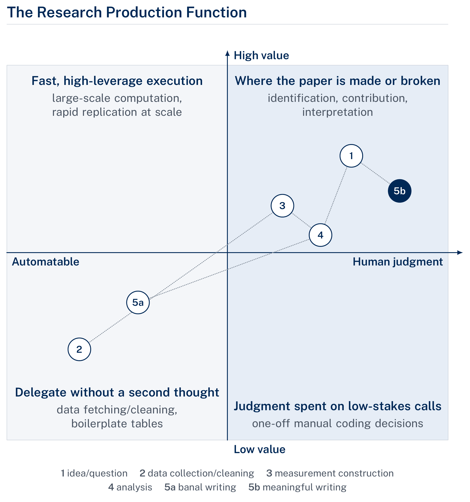
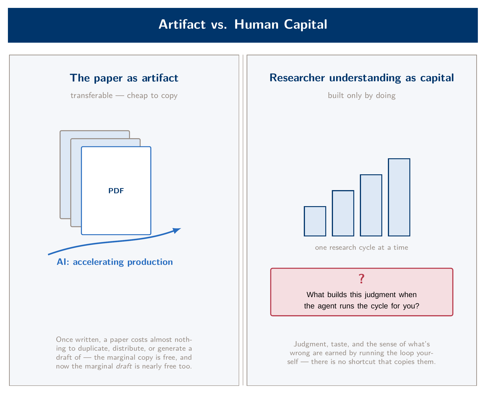
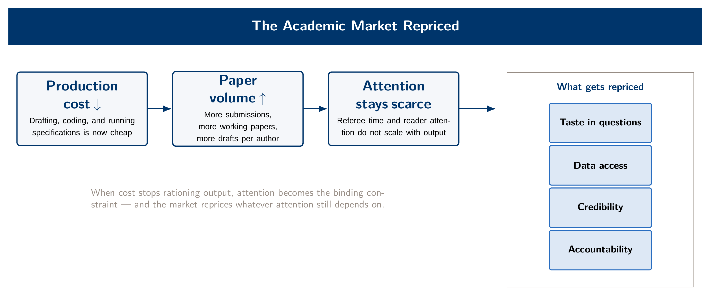

[Module 6 slides (PDF)](../assets/slides/day6_slides.pdf)

For five modules you have been building. You pulled a firm-year panel from public filings in an afternoon, turned a folder of 10-Ks into a defensible text measure, connected an agent to WRDS on your own credentials, and hardened one of those pipelines into something a stranger could rerun from the README. Each of those tasks would have taken a competent RA a week or more in 2019. That fact is the seminar. There is no lab in this module, because the question in front of us is not how to do these things — you know how — but what it means for the profession that anyone can.

The seminar is organized around three questions, in ascending order of discomfort. First, if AI produces the artifact, what happens to the learning — what is PhD training actually for? Second, does it matter, epistemically or socially, whether a human or a machine produced a result? Third, papers are the currency of the academic labor market — what happens to that market when the cost of producing a competent paper collapses? None of these has a settled answer. You will be asked to defend positions, not to find the right one, and the deliverable — a one-page memo titled "What I will still be paid for in 2036" — asks you to bet on your own answer.

::: {.callout-note icon=false}
## What this module asks of you

Come having done the readings — they are short, deliberately so, and every discussion block leans on them. Come with your own dissertation in mind: the sorting exercises are about your research, not research in the abstract. And come willing to be argued out of a position. The debate assignments handed out in Module 5 are deliberately adversarial; several of you will defend claims you do not believe. That is the point.
:::

## The map you already know

In Module 1 you saw the research pipeline — idea, data, measure, analysis, paper — shaded by where an agent accelerates the work and where judgment stays human. You have now lived that map across the course, which earns you the harder version of it: the same pipeline plotted against two axes, how automatable each stage is and how much of the paper's value it carries.

{fig-alt="Map of research pipeline stages plotted on two axes: how automatable each stage is and how much of a paper's value it carries."}

The upper-left quadrant is where this course lived — execution work that an agent does faster than you and about as well. The upper-right is where papers are made or broken: identification, contribution, interpretation. The uncomfortable observation, and the seed of everything that follows, is that the boundary between those quadrants is not fixed. Measurement construction sat comfortably on the human side of the line five years ago. You moved it across in Module 3 in eighty minutes. When the seminar opens, you will place your own dissertation's stages on a blank version of this map, and defend the placement to the person next to you.

## Question 1 — The artifact and the capital

A paper is an artifact: transferable, citable, cheap to copy once it exists. A researcher's understanding is capital: built only by doing the work, and the thing a PhD program exists to produce. For most of the history of the profession, the two were bundled — you could not produce the artifact without accumulating the capital, so the paper served as reliable evidence of the researcher. Agentic AI unbundles them. Across this course you produced artifacts at a pace no amount of your own understanding could previously have sustained. The question is what happened, during those same hours, to the capital.

{fig-alt="Diagram contrasting the paper as a transferable artifact with the researcher's understanding as capital, and agentic AI splitting the bundle between them."}

The cognitive-science evidence assigned for this module is not reassuring. Macnamara and coauthors argue that AI assistance targets precisely the demanding sub-tasks through which expertise gets built, and that skill decay proceeds without the performer noticing — their analogy is aviation autopilot, and the pilots did not feel their hand-flying skills eroding either. Gerlich's survey evidence points the same direction, with one wrinkle worth arguing about: higher educational attainment buffers the effect without eliminating it. Whether graduate training provides the metacognitive scaffolding to use these tools without atrophy, or whether it merely delays the onset, is exactly the kind of question this room is qualified to fight about.

Module 5 gave you the personal version of this question — the banal/meaningful line and the test that goes with it: can you discuss the finding without the LLM? This module's version is institutional. If the capital no longer has to be built to produce the artifact, does the profession keep building it anyway, on purpose, the way we still teach proofs to students who will never prove anything new? Or does PhD training quietly become something else?

## Question 2 — Provenance: man versus machine

Take two identical extraction results from the Module 3 pipeline. One was hand-coded by an RA over three weeks; the other came from a Claude session with a complete audit trail — cached inputs, quality report, committed code, a stratified human audit sample. Are they epistemically equivalent? Should a referee treat them identically? Most people's intuitions say no and yes at the same time, which is why this block exists.

The institutional anchor for this discussion is *Nature*'s editorial position: no language model will be credited as an author, because authorship carries accountability that a model cannot discharge — and that any use must be documented. The first half of that position echoes a line that predates the technology by four decades, from a 1979 IBM training manual: a computer can never be held accountable. The second half is where the profession is now putting its practical energy: disclosure policies, audit trails, verification as the locus of credibility. Notice that this is the discipline you built in Module 5 — the paper trail was never really about catching Claude's mistakes; it was about making your work legible to a profession that is about to care very much about provenance.

Two complications keep this from being tidy. The first: a spotless audit trail can still deliver a wrong estimate. Documentation is a map, not a verdict — you verified that personally when the DECISIONS.md claimed a robustness check the commit history did not contain. The second is a case study the field handed us. In 2024 a working paper claiming a randomized rollout of an AI materials-discovery tool — with a 44% jump in researcher output — circulated to acclaim from some of the most prominent economists in the field before it was found to be fabricated and withdrawn, its author severed from MIT. The provenance-checking machinery of economics failed *before* AI was writing papers. Whether AI makes that machinery stronger (audit trails, replication at near-zero cost) or weaker (volume, plausibility at scale) is the sharpest version of Question 2, and it is open.

A ten-minute segment inside this block takes up a narrower epistemics puzzle from your Module 5 toolkit: when a second model reviews the first model's code, what exactly is being verified? Correlated training plausibly produces correlated blind spots — the review catches real errors, and you saw it catch one, but it is not independent in the sense a statistician means by the word.

## Question 3 — The market for papers

Papers are how this profession pays people. Placement, tenure, prestige, salary — all of it clears through a market in which publications are the currency, and the currency has always been expensive to mint. You now know, from direct experience, roughly what happened to the minting cost across this course.

{fig-alt="Diagram of the academic market repricing as production costs fall, with surplus shifting toward question taste, data access, credibility, and accountability."}

The assigned readings give you the pre-AI baseline, and it was already strained. Bloom, Jones, Van Reenen, and Webb document that ideas have been getting harder to find for decades — research productivity falling even as research effort grows. Hadavand, Hamermesh, and Wilson document that economics publishes slower than any adjacent field, with most of the delay in authors' own revision cycles. And Lusher, Yang, and Carrell provide the congestion result that should worry you most directly: when more working papers drop in the same week, each one gets fewer downloads, less attention, and worse publication outcomes — and the effect is not confined to weak papers. Now run the experiment this room is equipped to run: suppose every accounting PhD student in the world can do what you did in Module 4. What does the JAR submission queue look like in five years? Who referees it? What happens to the signal value of a publication when the floor of publishable quality rises and the volume triples?

The economics of the answer are older than the technology. When a production input gets cheap, the surplus moves to whatever remains scarce. The candidates for what stays scarce in research are worth naming precisely, because they are the investable assets of your remaining PhD years: question taste — knowing which of the now-cheap papers is worth writing; data access and institutional knowledge — the WRDS subscription mattered across this course, and so did knowing that `consol='C'` exists; credibility — a reputation for careful work, which the Module 5 disciplines compound; and accountability — the thing the IBM manual says the computer can never carry. There is also a homogenization question folded in here: if everyone's referee reports and everyone's prose pass through the same models, voice stops being a signal. Whether that is a market failure (peer review relied on the signal) or a mild efficiency gain (house styles compressed voice anyway) is one of the assigned debate positions, and it is less obvious than it looks.

## Format, readings, and the memo

The seminar runs about two and a half hours: a forty-minute framing lecture tracing the arc above, then three structured discussion blocks of roughly thirty minutes — position statements from the assigned debaters, open discussion, instructor synthesis — with the dissertation-placement exercise opening Block 1 and each block closing on a named question. There is no lab and nothing to install. This course's build modules are your evidence base; cite them the way you would cite data.

**Required readings** (distributed Module 5; roughly 80–100 minutes total):

- Korinek, Anton (2023). "Generative AI for Economic Research: Use Cases and Implications for Economists." *Journal of Economic Literature* 61(4): 1281–1317. Read pp. 1281–1290 and the speculative section, pp. 1310–1317.
- Bloom, Nicholas, Charles I. Jones, John Van Reenen, and Michael Webb (2020). "Are Ideas Getting Harder to Find?" *American Economic Review* 110(4): 1104–1144. Read the introduction and conclusion.
- Macnamara, Brooke N., et al. (2024). "Does Using Artificial Intelligence Assistance Accelerate Skill Decay and Hinder Skill Development Without Performers' Awareness?" *Cognitive Research: Principles and Implications* 9(1): 46. Read in full (12 pages, open access).
- Editors of *Nature* (2023). "Tools Such as ChatGPT Threaten Transparent Science; Here Are Our Ground Rules for Their Use." *Nature* 613: 612. Read in full (2 pages).
- Lusher, Lester, Wenni Yang, and Scott E. Carrell (2023). "Congestion on the Information Superhighway: Inefficiencies in Economics Working Papers." *Journal of Public Economics* 225: 104978. Read in full (~8 pages).

**Recommended for accounting depth:** Kim, Muhn, and Nikolaev (2024), "Financial Statement Analysis with Large Language Models" (SSRN 4835311) — GPT-4 outperforming the median analyst at predicting earnings changes is Question 2 and Question 3 in one case study; and Dong, Stratopoulos, and Wang (2024), "A Scoping Review of ChatGPT Research in Accounting and Finance," *International Journal of Accounting Information Systems* 55: 100715, for the field-specific frontier.

::: {.callout-tip icon=false}
## The position memo — "What I will still be paid for in 2036"

Due one week after the seminar, one page. Commit to specific components of the research production function that you believe stay human, and defend the claim with at least one assigned reading and at least one concrete experience from the build modules. Close with one investment you will make in your remaining PhD years as a consequence. Graded credit/no-credit on defended specificity: an optimist and a pessimist can both earn credit; a vague memo cannot. AI assistance is permitted everywhere in this course except the argument of this memo, which must be yours — editor-not-rewriter help is fine, and you should disclose what you used, in one line, exactly as the journals discussed in this module would ask of you.
:::

One closing observation, carried forward from the course rather than the readings. Every discipline this course taught — verify before you sign off, request the paper trail before the work happens, make the pipeline rerunnable by a stranger — was introduced as hygiene. This module's discussion suggests a different reading: in a market where competent artifacts are cheap, *demonstrated care is product differentiation*. The verification protocols are not overhead on your research. Increasingly, they are the research — the part a machine cannot yet sign.
