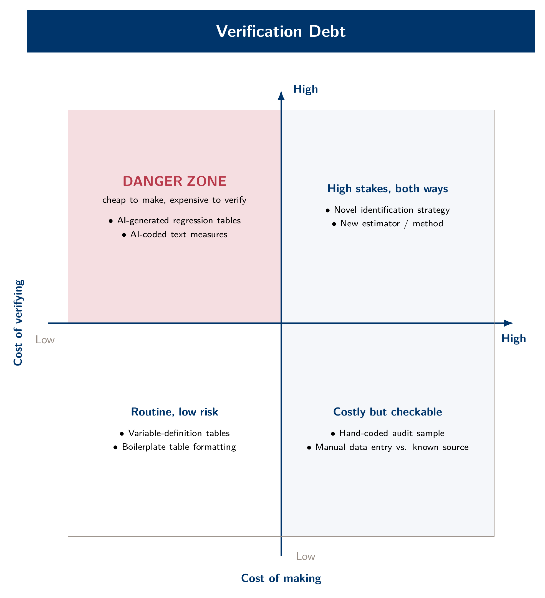

Every module in this course asks you to check something before you trust it, and the checks get more demanding as the course goes on. Module 1's habits still matter later. The checks grow because a full pipeline has more places for an error to hide than a single script does. This page collects the whole protocol in one place: the three mantras that sit underneath everything, the checks each module adds, and the verification-debt framework that explains why the checks have to grow. Print it and keep it as a protocol card, not just a reading.

## The three mantras

These three sentences, introduced in [Module 1](modules/01-foundations.qmd), run through the entire course.

1. **Files persist; context doesn't.** Anything that must outlast this session has to be written to a file: a decision, a row count, a variable definition. A conversation is gone when the session ends. A file on disk is not.
2. **Trust, but verify — same as an RA.** Delegate freely. Sign off only after you've checked something specific (one number, one benchmark, one hand-read filing) against a source the agent didn't touch.
3. **Be specific: file, operation, aggregation, output.** Name all four in every prompt. A vague request doesn't fail loudly. It produces something that looks plausible but isn't quite what you meant, and the gap grows the longer it goes unchecked.

## Verification escalates, module by module

Each module adds a verification habit on top of the ones before it. None of them retire. Module 5's protocol still includes Module 1's one-number check; it just isn't the only thing you're doing anymore.

**Module 1 — one number, one independent source.** Before accepting any computed output, such as a row count, a ratio or a figure, pick one value you can check against a source the agent did not touch, and check it by hand. The agent cannot do this step for you.

**Module 2 — two sanity checks, named in advance.** Before the first figure, have Claude write a `DATA_PROFILE.md` that records what one row of each table is and what can go wrong with it. Before you aggregate, plot the raw firm-level series, once before winsorizing and once after, so outliers, collapsing observation counts and suspicious zeros show up before a median hides them. Then run two checks. The first is a benchmark comparison: does the result match a pattern you already have a strong prior about? Pharma and software should show higher R&D intensity than utilities or retail. The second is a plausibility check tied to a known event: does the series show *some* response to a real shock, or does a suspiciously smooth line suggest over-aggregation? Name both checks before the figure renders, so you don't reason backward from whatever it happens to show.

**Module 3 — a quality report, plus the audit-sample protocol.** After any extraction pass, read the quality report on the failures. Do not treat the headline success rate as the finding. A claim of 99% extracted hides a selection problem if the missing 1% differs systematically from the rest. Before a text-based measure goes into a paper's main table, run a stratified human audit. Pick fifty filings spanning high, middle and low values of the measure, across firm size and industry, and code them against a rubric decided in advance. If more than one person codes them, report an inter-rater agreement statistic. If only one person did, say so plainly.

**Module 4 — four inspection checks, plus the iron laws.** After every WRDS pull, and before telling anyone the extract is good, run four checks: a row count compared with an expectation you wrote down beforehand, a `.head()`/`.sample()` look at actual values, a null check on the columns you plan to use, and a date-range check against what the query should have returned. Apply the four Compustat iron-law filters (`indfmt = 'INDL'`, `datafmt = 'STD'`, `popsrc = 'D'`, `consol = 'C'`) before you look at a single row. CRSP's share-type and exchange filters are never applied automatically. You apply them yourself, every time, including for "a quick test." For any regression you plan to report, add one more check: independent Python and Stata versions of the same model should agree on the coefficients to six decimals, and any gap in the standard errors needs a named default to explain it.

**Module 5 — the full paper trail, cross-checked against commits.** Request a `DECISIONS.md`, a `LOG.md` and a sample-attrition table up front rather than reconstructing them afterward. Then check them instead of filing them away. An LLM will write a documentation entry claiming work was done that never happened. The fix is to pick one specific claim, find the commit it should correspond to, and confirm the diff does what the prose says. Documentation tells you where to look. It does not prove the work was done. Two more checks sit on top. The first is the two-command credential audit: `git log --all --full-history -- .env` and a grep for any credential string, both of which should return nothing. The second is the no-hand-typed-numbers rule: every number in a manuscript comes from `\input{}`-ing a file a script generated, never from a person copying terminal output into a draft.

## Verification debt

[Module 5](modules/05-writing-verify.qmd) names the reason the checks have to grow. Every task has two costs: the cost of making it, and the cost of verifying that it's correct. Before agentic tools, those costs often moved together. Something expensive to build had usually been checked along the way, because it was built slowly. Agentic coding breaks that link. A keyword-based text measure or a regression table can now be made in minutes, while the cost of verifying it has fallen far less. The gap between those two costs is **verification debt**.

{fig-alt="Two-by-two grid of cost to make against cost to verify, with the cheap-to-make, costly-to-verify quadrant marked as the danger zone."}

The safe zone is expensive to make and expensive to verify, because slow production forces checking along the way. The danger zone is the opposite corner: cheap to make and costly to verify. An AI-drafted regression table or a decade of keyword counts over 10-K text tends to land there. More autonomy makes this worse. The more freedom an agent has to work unsupervised, the faster debt builds up, because checking that would have been spread across many small checkpoints arrives all at once, as a finished-looking repo. Approving each step manually does not fix this by itself. Approving a step you don't understand is a rubber stamp with extra clicks. What matters is how much you understand and check as the work happens.

---

*Print this page and keep it next to your desk during a build module. The three mantras and the module-by-module checklist above are the protocol card that every module in this course refers to.*
